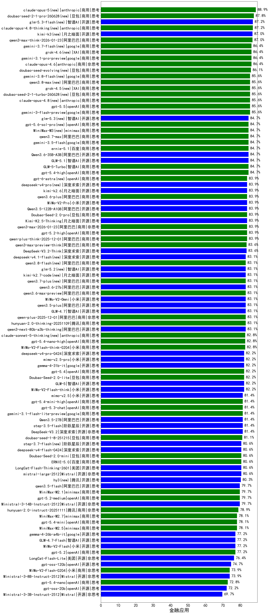

|类别|机构|大模型|【金融应用】准确率|平均耗时|平均消耗token|花费/千次（元）|排名（准确率）|
|---|---|-----|-------------------|-------|-----------|-----------|-----------|
|开源|阿里巴巴|qwen3-235b-a22b-thinking-2507(new)|87.0%|83s|1825|33.8|1|
|商用|阿里巴巴|qwen3-max-think-2026-01-23(new)|87.0%|123s|2095|19.8|2|
|商用|anthropic|claude-opus-4.6(new)|86.4%|13s|526|59.5|3|
|商用|google|gemini-3.1-pro-preview(new)|86.4%|37s|956|70.6|4|
|商用|anthropic|claude-opus-4.5(new)|85.6%|12s|589|71.7|5|
|商用|google|gemini-3-flash-preview(new)|85.6%|65s|970|17.9|6|
|开源|阿里巴巴|qwen3-235b-a22b-instruct-2507(new)|85.3%|7s|432|2.6|7|
|商用|anthropic|claude-sonnet-4.5-thinking(new)|85.3%|16s|1221|110.0|8|
|商用|openAI|gpt-5.4-high(new)|84.7%|8s|461|34.1|9|
|商用|智谱AI|GLM-5-Turbo(new)|84.7%|27s|893|17.4|10|
|商用|阿里巴巴|qwen3-max-preview(new)|84.7%|7s|426|7.6|11|
|开源|智谱AI|GLM-5.1(new)|84.7%|115s|993|21.4|12|
|开源|阿里巴巴|Qwen3.6-35B-A3B(new)|84.7%|102s|1299|12.8|13|
|商用|阿里巴巴|qwen3-max-2025-09-23(new)|84.7%|201s|402|7.0|14|
|商用|anthropic|claude-sonnet-4.5(new)|84.5%|10s|554|40.0|15|
|商用|阿里巴巴|qwen-plus-think-2025-12-01(new)|83.9%|44s|1770|13.1|16|
|开源|月之暗面|Kimi-K2.5-Thinking(new)|83.9%|200s|1034|19.5|17|
|开源|阿里巴巴|Qwen3.5-122B-A10B(new)|83.9%|194s|1851|11.1|18|
|商用|openAI|gpt-5.2-high(new)|83.9%|6s|333|18.7|19|
|商用|小米|MiMo-V2-Pro(new)|83.9%|201s|1056|16.8|20|
|商用|豆包|Doubao-Seed-2.0-pro(new)|83.9%|162s|823|10.7|21|
|商用|阿里巴巴|qwen3-max-2026-01-23(new)|83.9%|88s|429|3.2|22|
|商用|阿里巴巴|qwen3.6-plus(new)|83.9%|34s|1234|13.4|23|
|开源|月之暗面|kimi-k2.6(new)|83.9%|47s|965|23.4|24|
|商用|百度|ERNIE-X1.1-Preview(new)|83.6%|109s|805|2.8|25|
|商用|阿里巴巴|qwen3-max-preview-think(new)|83.6%|128s|1780|40.0|26|
|开源|深度求索|DeepSeek-V3.2-Think(new)|83.6%|108s|811|2.3|27|
|商用|anthropic|claude-4-sonnet(new)|83.5%|42s|545|38.0|28|
|开源|阿里巴巴|Qwen3-32B(new)|83.1%|17s|648|2.1|29|
|开源|深度求索|DeepSeek-V3.1(new)|83.1%|14s|316|2.7|30|
|开源|智谱AI|GLM-4.7(new)|83.1%|37s|1448|18.8|31|
|商用|openAI|gpt-5.1-medium(new)|83.1%|124s|376|16.4|32|
|开源|阿里巴巴|qwen3-next-80b-a3b-thinking(new)|83.1%|112s|2277|8.7|33|
|开源|阿里巴巴|qwen3.5-plus(new)|83.1%|24s|1914|8.6|34|
|商用|阿里巴巴|qwen-plus-2025-12-01(new)|83.1%|14s|618|1.1|35|
|商用|豆包|doubao-seed-1-6-lite-251015(new)|83.1%|25s|529|0.9|36|
|商用|腾讯|hunyuan-2.0-thinking-20251109(new)|83.1%|10s|724|2.5|37|
|商用|openAI|gpt-5.1-high(new)|83.1%|77s|562|29.6|38|
|商用|小米|MiMo-V2-Omni(new)|83.1%|234s|1167|12.0|39|
|商用|阿里巴巴|qwen3.6-max-preview(new)|83.1%|38s|1272|62.4|40|
|商用|豆包|doubao-seed-1-6-251015(new)|83.1%|34s|566|3.3|41|
|商用|小米|MiMo-V2-Flash-think-0204(new)|82.8%|558s|1396|2.7|42|
|商用|openAI|gpt-5.4-nano-high(new)|82.8%|28s|351|1.9|43|
|开源|小米|MiMo-V2-Flash-think(new)|82.2%|74s|1470|0.0|44|
|商用|百度|ERNIE-5.0-Thinking-Preview(new)|82.2%|139s|1054|23.0|45|
|商用|小米|mimo-v2.5-pro(new)|82.2%|21s|1055|16.7|46|
|商用|腾讯|hunyuan-turbos-20250926(new)|82.2%|9s|478|0.7|47|
|开源|智谱AI|GLM-5(new)|82.2%|76s|1350|22.4|48|
|商用|openAI|gpt-5.4(new)|82.2%|4s|272|14.1|49|
|开源|阿里巴巴|Qwen3-14B-nothink(new)|82.2%|13s|458|0.7|50|
|商用|anthropic|claude-4-sonnet-thinking(new)|82.2%|29s|544|39.0|51|
|开源|google|gemma-4-31b-it(new)|82.2%|42s|404|0.8|52|
|商用|豆包|Doubao-Seed-2.0-lite(new)|82.2%|104s|640|1.7|53|
|开源|阿里巴巴|Qwen3-14B(new)|81.9%|18s|886|1.6|54|
|商用|百度|ERNIE-4.5-Turbo-32K(new)|81.7%|12s|360|0.9|55|
|商用|google|gemini-2.5-pro(new)|81.5%|25s|1706|114.2|56|
|开源|阶跃星辰|step-3.5-flash(new)|81.4%|14s|1191|2.3|57|
|开源|阿里巴巴|Qwen3.5-27B(new)|81.4%|185s|1967|8.9|58|
|商用|google|gemini-3.1-flash-lite-preview(new)|81.4%|10s|360|2.4|59|
|商用|openAI|gpt-5.3-chat(new)|81.4%|17s|316|16.8|60|
|商用|openAI|gpt-5.4-mini-high(new)|81.4%|40s|452|9.9|61|
|商用|小米|mimo-v2.5(new)|81.4%|22s|1088|10.9|62|
|开源|深度求索|DeepSeek-V3.2(new)|81.4%|52s|286|0.7|63|
|开源|阿里巴巴|Qwen3-30B-A3B-Thinking-2507(new)|81.4%|44s|1652|4.3|64|
|商用|XAI|grok-4-1-fast-reasoning(new)|81.4%|58s|1025|3.0|65|
|商用|腾讯|hunyuan-t1-20250711(new)|81.4%|19s|1448|4.6|66|
|开源|豆包|Seed-OSS-36B-Instruct(new)|81.4%|63s|998|3.6|67|
|开源|月之暗面|Kimi-K2-Thinking(new)|81.4%|96s|1345|20.0|68|
|开源|月之暗面|kimi-k2-0905(new)|81.1%|54s|324|3.4|69|
|商用|豆包|doubao-seed-1-8-251215(new)|81.1%|18s|518|2.8|70|
|商用|google|gemini-2.5-flash(new)|81.1%|7s|1325|21.6|71|
|商用|豆包|Doubao-Seed-2.0-mini(new)|80.6%|168s|1049|1.8|72|
|开源|Mistral|mistral-large-2512(new)|80.6%|10s|533|4.2|73|
|商用|百度|ERNIE-X1-Turbo-32K(new)|80.6%|57s|1200|4.4|74|
|开源|阿里巴巴|qwen3-next-80b-a3b-instruct(new)|80.6%|9s|492|1.5|75|
|开源|深度求索|DeepSeek-V3.1-Think(new)|80.6%|41s|849|9.1|76|
|开源|美团|LongCat-Flash-Thinking-2601(new)|80.6%|116s|1522|0.0|77|
|商用|百度|ERNIE-5.0(new)|80.6%|118s|1115|24.5|78|
|开源|深度求索|DeepSeek-R1-0528(new)|80.4%|194s|1473|22.0|79|
|开源|阿里巴巴|Qwen3-4B(new)|79.8%|11s|766|1.9|80|
|开源|阿里巴巴|qwen3.5-flash(new)|79.7%|220s|2147|4.0|81|
|商用|阿里巴巴|qwen-turbo-think-2025-07-15(new)|79.7%|/|1406|3.8|82|
|商用|minimax|MiniMax-M2.1(new)|79.7%|88s|939|6.9|83|
|开源|Mistral|Ministral-3-14B-Instruct-2512(new)|79.7%|14s|1101|1.6|84|
|商用|openAI|gpt-5.2-medium(new)|79.7%|5s|312|16.7|85|
|开源|阿里巴巴|Qwen3-8B(new)|79.6%|27s|889|0.0|86|
|商用|anthropic|claude-haiku-4.5(new)|78.9%|14s|598|14.5|87|
|商用|阿里巴巴|qwen-flash-think-2025-07-28(new)|78.9%|15s|1557|2.1|88|
|商用|腾讯|hunyuan-2.0-instruct-20251111(new)|78.9%|6s|400|0.6|89|
|商用|openAI|gpt-5-mini-high(new)|78.9%|456s|1367|17.7|90|
|商用|minimax|MiniMax-M2.7(new)|78.1%|20s|869|6.3|91|
|商用|openAI|gpt-5.1(new)|78.1%|201s|249|7.4|92|
|商用|XAI|grok-4-1-fast-non-reasoning(new)|78.1%|39s|541|1.3|93|
|商用|minimax|MiniMax-M2.5(new)|78.1%|17s|885|6.4|94|
|商用|openAI|gpt-5.4-mini(new)|78.1%|31s|255|3.7|95|
|开源|阿里巴巴|Qwen3-32B-nothink(new)|78.1%|53s|470|1.4|96|
|商用|openAI|gpt-5-2025-08-07(new)|78.1%|25s|372|16.9|97|
|商用|智谱AI|GLM-4.5-Flash-nothink(new)|77.8%|13s|723|0.0|98|
|商用|智谱AI|GLM-4.5-Flash(new)|77.8%|27s|1611|0.0|99|
|商用|openAI|o4-mini(new)|77.6%|28s|586|14.8|100|
|开源|meta|Llama-4-Scout-17B-16E-Instruct(new)|77.2%|8s|493|0.9|101|
|开源|google|gemma-4-26b-a4b-it(new)|77.2%|41s|480|1.0|102|
|开源|小米|MiMo-V2-Flash(new)|77.2%|73s|369|0.0|103|
|商用|anthropic|claude-haiku-4.5-thinking(new)|77.2%|38s|1471|45.3|104|
|商用|openAI|gpt-5.2(new)|77.2%|5s|248|10.3|105|
|开源|智谱AI|GLM-4.7-Flash(new)|77.2%|861s|1599|0.0|106|
|开源|美团|LongCat-Flash-Lite(new)|76.4%|164s|389|0.0|107|
|商用|openAI|gpt-5-nano-2025-08-07(new)|76.4%|58s|1154|2.9|108|
|开源|智谱AI|GLM-4.5-Air-nothink(new)|76.4%|8s|717|3.6|109|
|商用|openAI|gpt-5-nano-high(new)|76.4%|433s|2529|6.9|110|
|商用|百川智能|Baichuan4-Turbo(new)|76.3%|/|/|/|111|
|开源|阿里巴巴|Qwen3-8B-nothink(new)|75.6%|45s|431|0.0|112|
|商用|阿里巴巴|qwen-turbo-2025-07-15(new)|75.6%|6s|329|0.2|113|
|开源|阿里巴巴|Qwen3-30B-A3B-Instruct-2507(new)|75.6%|3s|485|1.1|114|
|商用|阿里巴巴|qwen-flash-2025-07-28(new)|75.3%|6s|457|0.5|115|
|开源|智谱AI|GLM-4-9B-0414(new)|74.9%|7s|363|0.0|116|
|商用|google|gemini-2.5-flash-lite(new)|74.7%|4s|527|1.2|117|
|开源|智谱AI|GLM-4.5-Air(new)|74.7%|31s|1576|8.7|118|
|开源|openAI|gpt-oss-120b(new)|74.7%|16s|526|1.2|119|
|商用|openAI|gpt-5-mini-2025-08-07(new)|74.7%|48s|631|7.1|120|
|商用|小米|MiMo-V2-Flash-0204(new)|73.9%|173s|425|0.7|121|
|开源|阿里巴巴|Qwen3-4B-nothink(new)|73.9%|16s|419|0.8|122|
|开源|Mistral|Ministral-3-8B-Instruct-2512(new)|73.9%|13s|1146|1.2|123|
|商用|openAI|gpt-5.4-nano(new)|72.8%|18s|259|1.1|124|
|开源|openAI|gpt-oss-20b(new)|72.2%|45s|616|0.5|125|
|开源|Mistral|Ministral-3-3B-Instruct-2512(new)|69.7%|7s|588|0.4|126|

