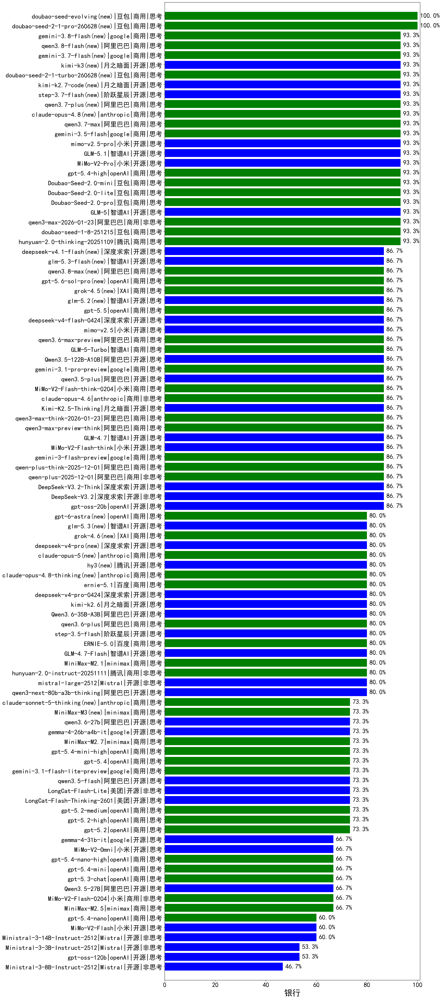

|类别|机构|大模型|【银行】准确率|平均耗时|平均消耗token|花费/千次（元）|排名（准确率）|
|---|---|-----|-------------------|-------|-----------|-----------|-----------|
|商用|腾讯|hunyuan-turbos-20250926|100.0%|9s|428|0.7|1|
|商用|百度|ERNIE-4.5-Turbo-32K|96.7%|19s|494|1.4|2|
|开源|阿里巴巴|qwen3-235b-a22b-instruct-2507|93.3%|8s|351|2.4|3|
|商用|阿里巴巴|qwen3-max-2026-01-23|93.3%|63s|338|2.9|4|
|商用|豆包|Doubao-Seed-2.0-lite(new)|93.3%|162s|793|2.5|5|
|商用|豆包|Doubao-Seed-2.0-mini(new)|93.3%|253s|1202|2.2|6|
|商用|豆包|doubao-seed-1-8-251215|93.3%|25s|516|3.3|7|
|开源|智谱AI|GLM-5(new)|93.3%|61s|1375|23.9|8|
|商用|openAI|gpt-5.4-high(new)|93.3%|18s|679|64.5|9|
|开源|月之暗面|kimi-k2-0905|93.3%|61s|273|3.4|10|
|商用|小米|MiMo-V2-Pro(new)|93.3%|56s|965|15.9|11|
|商用|豆包|Doubao-Seed-2.0-pro(new)|93.3%|232s|1041|15.2|12|
|商用|腾讯|hunyuan-2.0-thinking-20251109|93.3%|9s|583|2.2|13|
|开源|智谱AI|GLM-5.1(new)|93.3%|126s|1137|26.2|14|
|开源|小米|MiMo-V2-Flash-think|86.7%|69s|1558|0.0|15|
|开源|智谱AI|GLM-4.7|86.7%|42s|1473|19.9|16|
|开源|深度求索|DeepSeek-V3.1-Think|86.7%|39s|765|8.7|17|
|商用|阿里巴巴|qwen-plus-think-2025-12-01|86.7%|43s|1804|13.9|18|
|商用|阿里巴巴|qwen3-max-preview|86.7%|7s|357|7.3|19|
|商用|阿里巴巴|qwen-plus-2025-12-01|86.7%|15s|548|1.0|20|
|商用|豆包|doubao-seed-1-6-251015|86.7%|5s|573|3.9|21|
|商用|豆包|doubao-seed-1-6-lite-251015|86.7%|81s|657|1.4|22|
|开源|月之暗面|Kimi-K2-Thinking|86.7%|95s|1287|19.8|23|
|开源|深度求索|DeepSeek-V3.2|86.7%|99s|249|0.7|24|
|开源|深度求索|DeepSeek-V3.2-Think|86.7%|22s|685|2.0|25|
|商用|anthropic|claude-opus-4.6|86.7%|12s|518|75.5|26|
|开源|月之暗面|Kimi-K2.5-Thinking|86.7%|204s|871|17.2|27|
|商用|阿里巴巴|qwen3-max-preview-think|86.7%|108s|1788|41.6|28|
|商用|anthropic|claude-sonnet-4.5-thinking|86.7%|18s|1254|124.5|29|
|商用|百度|ERNIE-X1.1-Preview|86.7%|90s|488|1.8|30|
|商用|小米|MiMo-V2-Flash-think-0204(new)|86.7%|575s|1139|2.3|31|
|商用|阿里巴巴|qwen3-max-think-2026-01-23|86.7%|90s|2613|25.6|32|
|商用|anthropic|claude-opus-4.5|86.7%|10s|617|94.4|33|
|商用|阿里巴巴|qwen3-max-2025-09-23|86.7%|294s|337|6.8|34|
|商用|阿里巴巴|qwen3.6-max-preview(new)|86.7%|42s|1403|72.7|35|
|商用|google|gemini-3-flash-preview|86.7%|39s|1039|20.9|36|
|开源|阿里巴巴|qwen3-235b-a22b-thinking-2507|86.7%|53s|2340|45.5|37|
|开源|阿里巴巴|Qwen3-14B|86.7%|24s|855|1.6|38|
|商用|智谱AI|GLM-5-Turbo(new)|86.7%|26s|1115|23.5|39|
|商用|百度|ERNIE-X1-Turbo-32K|86.7%|70s|1526|5.9|40|
|开源|阿里巴巴|qwen3.5-plus(new)|86.7%|34s|2674|12.6|41|
|开源|阿里巴巴|Qwen3.5-122B-A10B(new)|86.7%|174s|2167|13.5|42|
|商用|腾讯|hunyuan-t1-20250711|86.7%|16s|994|3.7|43|
|开源|阿里巴巴|Qwen3-32B|86.7%|34s|1144|4.4|44|
|商用|google|gemini-3.1-pro-preview(new)|86.7%|22s|1121|90.6|45|
|开源|openAI|gpt-oss-20b|86.7%|109s|1009|1.1|46|
|开源|深度求索|DeepSeek-R1-0528|81.7%|220s|1750|27.2|47|
|商用|minimax|MiniMax-M2.1|80.0%|90s|1045|8.2|48|
|商用|腾讯|hunyuan-2.0-instruct-20251111|80.0%|4s|283|0.4|49|
|开源|智谱AI|GLM-4.7-Flash|80.0%|1378s|1646|0.0|50|
|开源|Mistral|mistral-large-2512|80.0%|8s|388|3.5|51|
|开源|阿里巴巴|qwen3-next-80b-a3b-thinking|80.0%|85s|2210|8.6|52|
|商用|阿里巴巴|qwen3.6-plus(new)|80.0%|40s|1361|15.6|53|
|开源|阿里巴巴|Qwen3.6-35B-A3B(new)|80.0%|105s|1341|13.9|54|
|商用|百度|ERNIE-5.0|80.0%|126s|1321|30.7|55|
|商用|anthropic|claude-4-sonnet-thinking|80.0%|51s|502|45.2|56|
|商用|google|gemini-2.5-pro|80.0%|24s|2037|143.4|57|
|开源|深度求索|DeepSeek-V3.1|80.0%|16s|261|2.6|58|
|商用|阿里巴巴|qwen-turbo-think-2025-07-15|80.0%|/|2062|6.0|59|
|商用|anthropic|claude-sonnet-4.5(new)|80.0%|7s|506|45.6|60|
|商用|openAI|gpt-5.1-high|80.0%|153s|762|49.3|61|
|开源|阿里巴巴|Qwen3-8B-nothink|80.0%|66s|394|0.0|62|
|商用|XAI|grok-4-1-fast-reasoning|80.0%|82s|877|2.6|63|
|开源|阶跃星辰|step-3.5-flash|80.0%|13s|1153|2.3|64|
|开源|阿里巴巴|Qwen3-32B-nothink|80.0%|59s|389|1.3|65|
|商用|openAI|gpt-5.1-medium|80.0%|168s|410|24.2|66|
|开源|豆包|Seed-OSS-36B-Instruct|80.0%|60s|1129|4.3|67|
|开源|阿里巴巴|qwen3-next-80b-a3b-instruct|80.0%|8s|362|1.2|68|
|开源|智谱AI|GLM-4.5-Air-nothink|80.0%|16s|841|4.7|69|
|开源|阿里巴巴|Qwen3-8B|76.7%|903s|16050|0.0|70|
|开源|阿里巴巴|qwen3.5-flash(new)|73.3%|206s|2741|5.4|71|
|开源|美团|LongCat-Flash-Lite(new)|73.3%|117s|306|0.0|72|
|商用|minimax|MiniMax-M2.7(new)|73.3%|27s|1027|8.0|73|
|开源|google|gemma-4-26b-a4b-it(new)|73.3%|34s|490|1.2|74|
|商用|google|gemini-3.1-flash-lite-preview(new)|73.3%|20s|305|2.6|75|
|商用|openAI|gpt-5.4-mini-high(new)|73.3%|92s|556|15.5|76|
|开源|美团|LongCat-Flash-Thinking-2601|73.3%|127s|1845|0.0|77|
|商用|openAI|gpt-5.4(new)|73.3%|5s|221|16.4|78|
|商用|百川智能|Baichuan4-Turbo|73.3%|/|/|/|79|
|商用|anthropic|claude-4-sonnet|73.3%|58s|516|45.9|80|
|开源|meta|Llama-4-Scout-17B-16E-Instruct|73.3%|7s|468|0.9|81|
|商用|智谱AI|GLM-4.5-Flash-nothink|73.3%|18s|912|0.0|82|
|商用|阿里巴巴|qwen-flash-think-2025-07-28|73.3%|31s|2013|2.9|83|
|开源|阿里巴巴|Qwen3-30B-A3B-Thinking-2507|73.3%|61s|2231|6.1|84|
|商用|百度|ERNIE-5.0-Thinking-Preview|73.3%|225s|1030|23.7|85|
|商用|openAI|gpt-5.2-medium|73.3%|7s|309|23.9|86|
|商用|openAI|o4-mini|73.3%|31s|686|19.9|87|
|商用|openAI|gpt-5.2|73.3%|6s|180|11.1|88|
|商用|openAI|gpt-5.2-high|73.3%|15s|660|58.8|89|
|开源|阿里巴巴|Qwen3-4B|70.0%|19s|1362|3.9|90|
|开源|阿里巴巴|Qwen3-14B-nothink|66.7%|10s|385|0.7|91|
|商用|openAI|gpt-5-2025-08-07|66.7%|16s|289|16.4|92|
|商用|智谱AI|GLM-4.5-Flash|66.7%|19s|1024|0.0|93|
|开源|智谱AI|GLM-4.5-Air|66.7%|18s|910|5.1|94|
|商用|openAI|gpt-5.3-chat(new)|66.7%|22s|296|22.3|95|
|开源|阿里巴巴|Qwen3-30B-A3B-Instruct-2507|66.7%|5s|351|0.9|96|
|商用|openAI|gpt-5.4-mini(new)|66.7%|27s|207|4.5|97|
|开源|阿里巴巴|Qwen3.5-27B(new)|66.7%|321s|2425|11.4|98|
|商用|openAI|gpt-5-mini-high|66.7%|519s|1318|18.1|99|
|商用|小米|MiMo-V2-Flash-0204(new)|66.7%|146s|376|0.7|100|
|商用|openAI|gpt-5.4-nano-high(new)|66.7%|19s|371|2.7|101|
|商用|阿里巴巴|qwen-turbo-2025-07-15|66.7%|7s|286|0.2|102|
|商用|阿里巴巴|qwen-flash-2025-07-28|66.7%|18s|366|0.5|103|
|商用|google|gemini-2.5-flash|66.7%|9s|1522|26.5|104|
|商用|minimax|MiniMax-M2.5(new)|66.7%|19s|990|7.7|105|
|商用|openAI|gpt-5.1|66.7%|163s|165|6.9|106|
|商用|小米|MiMo-V2-Omni(new)|66.7%|318s|1205|13.4|107|
|商用|anthropic|claude-haiku-4.5-thinking|66.7%|28s|2373|81.6|108|
|开源|google|gemma-4-31b-it(new)|66.7%|103s|453|1.1|109|
|开源|智谱AI|GLM-4-9B-0414|66.7%|8s|390|0.0|110|
|开源|阿里巴巴|Qwen3-4B-nothink|66.7%|13s|323|0.8|111|
|商用|openAI|gpt-5.4-nano(new)|60.0%|26s|190|1.1|112|
|开源|小米|MiMo-V2-Flash|60.0%|49s|361|0.0|113|
|商用|openAI|gpt-5-mini-2025-08-07|60.0%|42s|641|8.3|114|
|商用|openAI|gpt-5-nano-2025-08-07|60.0%|54s|1198|3.3|115|
|商用|google|gemini-2.5-flash-lite|60.0%|2s|376|0.9|116|
|商用|anthropic|claude-haiku-4.5|60.0%|12s|549|16.4|117|
|商用|XAI|grok-4-1-fast-non-reasoning|60.0%|29s|496|1.3|118|
|开源|Mistral|Ministral-3-14B-Instruct-2512|60.0%|10s|388|0.6|119|
|商用|openAI|gpt-5-nano-high|53.3%|172s|3104|8.8|120|
|开源|Mistral|Ministral-3-3B-Instruct-2512|53.3%|9s|747|0.5|121|
|开源|openAI|gpt-oss-120b|53.3%|7s|489|1.3|122|
|开源|Mistral|Ministral-3-8B-Instruct-2512|46.7%|10s|401|0.4|123|

