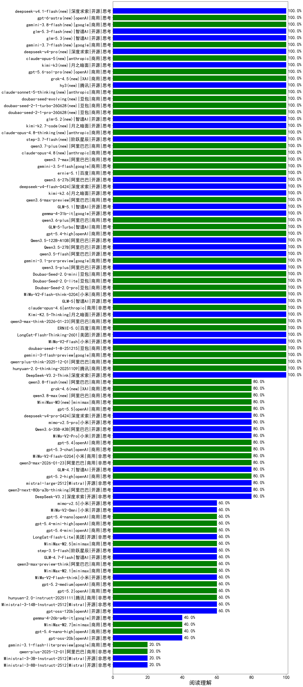

|类别|机构|大模型|【阅读理解】准确率|平均耗时|平均消耗token|花费/千次（元）|排名（准确率）|
|---|---|-----|-------------------|-------|-----------|-----------|-----------|
|开源|阿里巴巴|Qwen3.5-122B-A10B(new)|100.0%|435s|5446|31.1|1|
|商用|阿里巴巴|qwen3-max-think-2026-01-23(new)|100.0%|217s|3975|34.2|2|
|开源|月之暗面|kimi-k2-0905|100.0%|67s|946|7.5|3|
|商用|百度|ERNIE-X1.1-Preview|100.0%|142s|2174|6.8|4|
|商用|百度|ERNIE-5.0-Thinking-Preview|100.0%|139s|1706|29.6|5|
|商用|anthropic|claude-opus-4.5(new)|100.0%|20s|1891|162.6|6|
|开源|深度求索|DeepSeek-V3.2-Think(new)|100.0%|78s|2976|8.3|7|
|商用|腾讯|hunyuan-2.0-thinking-20251109|100.0%|14s|1668|4.8|8|
|商用|google|gemini-3-flash-preview(new)|100.0%|16s|2765|45.1|9|
|商用|豆包|doubao-seed-1-8-251215(new)|100.0%|41s|1451|6.1|10|
|开源|小米|MiMo-V2-Flash(new)|100.0%|21s|1067|0.0|11|
|商用|anthropic|claude-4-sonnet-thinking|100.0%|59s|1815|91.1|12|
|商用|anthropic|claude-4-sonnet|100.0%|46s|706|39.7|13|
|开源|美团|LongCat-Flash-Thinking-2601(new)|100.0%|288s|4249|0.0|14|
|商用|百度|ERNIE-5.0(new)|100.0%|161s|1808|32.1|15|
|商用|阿里巴巴|qwen-plus-think-2025-12-01(new)|100.0%|68s|3681|24.2|16|
|商用|豆包|Doubao-Seed-2.0-pro(new)|100.0%|230s|1609|16.0|17|
|商用|小米|MiMo-V2-Flash-think-0204(new)|100.0%|610s|3622|6.6|18|
|商用|anthropic|claude-opus-4.6(new)|100.0%|12s|1885|158.8|19|
|商用|google|gemini-3.1-pro-preview(new)|100.0%|56s|4363|316.6|20|
|开源|月之暗面|Kimi-K2.5-Thinking(new)|100.0%|588s|3380|60.5|21|
|开源|阿里巴巴|qwen3.5-plus(new)|100.0%|61s|5088|21.8|22|
|开源|智谱AI|GLM-5(new)|100.0%|106s|4857|77.9|23|
|开源|阿里巴巴|qwen3.5-flash(new)|100.0%|472s|6304|11.4|24|
|商用|豆包|Doubao-Seed-2.0-mini(new)|100.0%|384s|2320|3.3|25|
|开源|阿里巴巴|Qwen3.5-27B(new)|100.0%|326s|6165|26.8|26|
|商用|豆包|Doubao-Seed-2.0-lite(new)|100.0%|210s|1679|3.8|27|
|商用|openAI|o4-mini|96.0%|17s|733|17.1|28|
|商用|豆包|doubao-seed-1-6-251015|93.3%|16s|1673|7.4|29|
|商用|豆包|doubao-seed-1-6-thinking-250715|93.3%|3s|1607|8.2|30|
|商用|百度|ERNIE-X1-Turbo-32K|90.9%|423s|2294|7.2|31|
|商用|豆包|doubao-seed-1-6-250615|90.0%|129s|1090|2.6|32|
|开源|豆包|Seed-OSS-36B-Instruct|90.0%|410s|2286|7.5|33|
|商用|豆包|doubao-seed-1-6-flash-250615|90.0%|2s|1129|0.6|34|
|商用|豆包|Doubao-1.5-lite-32k-250115|86.7%|4s|712|0.3|35|
|开源|深度求索|DeepSeek-R1-0528|86.7%|129s|2585|33.6|36|
|开源|百度|ERNIE-4.5-300B-A47B|86.7%|239s|704|1.9|37|
|开源|深度求索|DeepSeek-V3.2-Exp-Think|86.7%|47s|1743|4.6|38|
|商用|豆包|doubao-seed-1-6-lite-251015|86.7%|23s|1765|2.5|39|
|商用|豆包|doubao-seed-1-6-flash-thinking-250615|83.3%|2s|1719|1.4|40|
|开源|阿里巴巴|qwen3-next-80b-a3b-instruct|83.3%|306s|1394|3.7|41|
|开源|阶跃星辰|step-3|83.3%|185s|2602|8.9|42|
|开源|深度求索|DeepSeek-V3.1-Think|83.3%|49s|1545|13.9|43|
|商用|科大讯飞|xunfei-spark-x1-0725|81.8%|/|1271|15.0|44|
|开源|minimax|MiniMax-M1|81.8%|68s|10036|75.3|45|
|商用|百度|ERNIE-4.5-Turbo-32K|81.8%|386s|844|0.9|46|
|开源|阿里巴巴|Qwen3-30B-A3B-Thinking-2507|80.0%|64s|3493|8.4|47|
|商用|阿里巴巴|qwen-flash-think-2025-07-28|80.0%|323s|3381|4.2|48|
|商用|openAI|gpt-5.1|80.0%|246s|1209|28.2|49|
|开源|月之暗面|Kimi-K2-Thinking|80.0%|163s|3579|49.9|50|
|开源|深度求索|DeepSeek-V3.2-Exp|80.0%|311s|843|1.9|51|
|商用|阿里巴巴|qwen3-max-preview|80.0%|295s|1126|15.6|52|
|商用|google|gemini-3-pro-preview(new)|80.0%|30s|3286|224.8|53|
|商用|阿里巴巴|qwen3-max-2026-01-23(new)|80.0%|176s|1657|11.1|54|
|商用|openAI|gpt-5.1-high|80.0%|171s|4246|243.8|55|
|开源|智谱AI|GLM-4.7(new)|80.0%|69s|4143|50.5|56|
|商用|anthropic|claude-sonnet-4.5-thinking|80.0%|51s|4689|401.1|57|
|商用|openAI|gpt-5-mini-high|80.0%|992s|3393|37.4|58|
|开源|深度求索|DeepSeek-V3.2(new)|80.0%|33s|891|2.0|59|
|开源|阿里巴巴|qwen3-235b-a22b-thinking-2507|80.0%|405s|3120|41.3|60|
|开源|阿里巴巴|qwen3-235b-a22b-instruct-2507|80.0%|27s|1295|6.5|61|
|开源|阿里巴巴|qwen3-next-80b-a3b-thinking|80.0%|183s|5346|19.2|62|
|商用|anthropic|claude-sonnet-4.5(new)|80.0%|9s|1816|91.1|63|
|商用|腾讯|hunyuan-t1-20250711|80.0%|43s|2433|7.8|64|
|开源|Mistral|mistral-large-2512(new)|80.0%|11s|1464|8.1|65|
|商用|google|gemini-2.5-pro|80.0%|231s|3089|181.0|66|
|商用|阿里巴巴|qwen-plus-2025-07-28|80.0%|295s|1259|1.8|67|
|商用|openAI|gpt-5.2-high(new)|80.0%|19s|1675|85.8|68|
|商用|小米|MiMo-V2-Flash-0204(new)|80.0%|116s|1263|1.6|69|
|商用|腾讯|hunyuan-turbos-20250926|76.7%|15s|1186|1.6|70|
|商用|阿里巴巴|qwen-plus-think-2025-07-28|76.7%|1329s|3307|21.9|71|
|商用|阿里巴巴|qwen-long-2025-01-25|76.7%|122s|417|0.5|72|
|开源|百度|ERNIE-4.5-21B-A3B|76.7%|55s|900|0.3|73|
|开源|智谱AI|GLM-4.5|76.7%|90s|2840|33.2|74|
|商用|百川智能|Baichuan4-Turbo|76.7%|/|/|/|75|
|开源|腾讯|Hunyuan-A13B-Instruct-nothink|76.7%|707s|869|1.6|76|
|开源|深度求索|DeepSeek-V3.1|76.7%|19s|912|6.3|77|
|商用|阿里巴巴|qwen-flash-2025-07-28|76.7%|355s|1362|1.2|78|
|开源|meta|Llama-4-Maverick-17B-128E-Instruct-FP8|76.7%|3s|368|0.9|79|
|商用|openAI|gpt-5-2025-08-07|76.7%|221s|1386|51.2|80|
|开源|月之暗面|kimi-k2-0711-preview|73.3%|68s|921|8.1|81|
|商用|百川智能|Baichuan4-Air|73.3%|/|/|/|82|
|开源|腾讯|Hunyuan-A13B-Instruct|73.3%|57s|2763|9.2|83|
|商用|360|360zhinao2-o1|73.3%|/|/|/|84|
|商用|XAI|grok-4-0709|72.7%|470s|1790|145.9|85|
|开源|阿里巴巴|Qwen3-14B|72.7%|195s|5174|9.2|86|
|开源|阿里巴巴|Qwen3-32B|72.7%|172s|3980|13.6|87|
|商用|openAI|gpt-5-mini-2025-08-07|70.0%|184s|1677|14.4|88|
|开源|minimax|MiniMax-M2|70.0%|52s|2826|19.1|89|
|商用|阿里巴巴|qwen-turbo-think-2025-07-15|70.0%|1168s|2576|6.0|90|
|商用|google|gemini-2.5-flash|70.0%|195s|3023|44.0|91|
|开源|阿里巴巴|Qwen3-8B|70.0%|84s|3068|0.0|92|
|开源|阿里巴巴|Qwen3-32B-nothink|70.0%|37s|1088|2.4|93|
|商用|智谱AI|GLM-4.5-Flash|70.0%|109s|2771|0.0|94|
|开源|智谱AI|GLM-4.6|70.0%|51s|3280|36.9|95|
|开源|智谱AI|GLM-4.5-Air|66.7%|249s|2941|14.5|96|
|开源|阿里巴巴|Qwen3-30B-A3B-Instruct-2507|66.7%|318s|1432|2.8|97|
|开源|minimax|MiniMax-Text-01|66.7%|6s|972|7.8|98|
|开源|智谱AI|GLM-4.5-nothink|66.7%|42s|1485|14.2|99|
|开源|阿里巴巴|Qwen3-14B-nothink|63.3%|272s|1186|1.4|100|
|商用|阿里巴巴|qwen-turbo-2025-07-15|63.3%|300s|1072|0.5|101|
|开源|智谱AI|GLM-4-9B-0414|63.3%|7s|718|0.0|102|
|商用|阿里巴巴|qwen3-max-preview-think(new)|60.0%|228s|3788|77.7|103|
|商用|openAI|gpt-5.2-medium(new)|60.0%|12s|1433|61.8|104|
|商用|google|gemini-2.5-flash-lite|60.0%|95s|1235|2.1|105|
|开源|小米|MiMo-V2-Flash-think(new)|60.0%|30s|3421|0.0|106|
|商用|openAI|gpt-5.2(new)|60.0%|15s|1152|33.8|107|
|商用|XAI|grok-3-mini|60.0%|369s|1851|5.8|108|
|商用|腾讯|hunyuan-2.0-instruct-20251111|60.0%|10s|1109|1.4|109|
|商用|minimax|MiniMax-M2.1(new)|60.0%|97s|2686|18.3|110|
|开源|Mistral|Ministral-3-14B-Instruct-2512(new)|60.0%|11s|1532|2.2|111|
|开源|openAI|gpt-oss-120b|60.0%|173s|1634|3.1|112|
|开源|智谱AI|GLM-4.7-Flash(new)|60.0%|989s|6928|0.0|113|
|开源|美团|LongCat-Flash-Lite(new)|60.0%|426s|1336|0.0|114|
|商用|anthropic|claude-haiku-4.5|60.0%|17s|1860|31.6|115|
|商用|阿里巴巴|qwen3-max-2025-09-23|60.0%|26s|1562|24.3|116|
|开源|阶跃星辰|step-3.5-flash(new)|60.0%|20s|3671|6.8|117|
|商用|anthropic|claude-haiku-4.5-thinking|60.0%|40s|5332|156.6|118|
|商用|minimax|MiniMax-M2.5(new)|60.0%|67s|4091|30.1|119|
|开源|智谱AI|GLM-4.5-Air-nothink|56.7%|226s|1330|4.9|120|
|开源|Mistral|Magistral-Small-2507|54.5%|54s|4850|46.9|121|
|商用|Mistral|mistral-medium-2508|54.5%|25s|1166|7.6|122|
|商用|openAI|gpt-5-nano-2025-08-07|53.3%|31s|3124|7.1|123|
|开源|meta|Llama-4-Scout-17B-16E-Instruct|53.3%|3s|411|0.5|124|
|开源|阿里巴巴|Qwen3-8B-nothink|53.3%|21s|999|0.0|125|
|商用|百度|ERNIE-Lite-8K|50.0%|/|/|/|126|
|商用|智谱AI|GLM-4.5-Flash-nothink|50.0%|56s|1267|0.0|127|
|开源|深度求索|DeepSeek-R1-0528-Qwen3-8B|45.5%|586s|2334|0.0|128|
|开源|阿里巴巴|Qwen3-4B-nothink|43.3%|300s|982|1.2|129|
|开源|google|gemma-3-27b-it|43.3%|/|/|/|130|
|商用|openAI|gpt-5.1-medium|40.0%|180s|2287|104.8|131|
|开源|openAI|gpt-oss-20b|40.0%|349s|2300|1.9|132|
|开源|google|gemma-3-12b-it|40.0%|/|/|/|133|
|开源|阿里巴巴|Qwen3-1.7B-nothink|36.7%|267s|1190|1.8|134|
|开源|阿里巴巴|Qwen3-4B|36.4%|96s|3100|7.2|135|
|开源|阿里巴巴|Qwen3-1.7B|36.4%|67s|3152|7.4|136|
|开源|阿里巴巴|Qwen3-0.6B|36.4%|71s|2490|5.4|137|
|开源|google|gemma-3-4b-it|30.0%|/|/|/|138|
|开源|Mistral|Mistral-Small-3.2-24B-Instruct-2506|27.3%|259s|1158|1.3|139|
|开源|阿里巴巴|Qwen3-0.6B-nothink|26.7%|331s|800|0.7|140|
|开源|百度|ERNIE-4.5-0.3B|20.0%|193s|832|0.1|141|
|商用|XAI|grok-4-1-fast-reasoning|20.0%|93s|2649|7.5|142|
|商用|阿里巴巴|qwen-plus-2025-12-01(new)|20.0%|29s|2043|3.2|143|
|商用|openAI|gpt-5-nano-high|20.0%|786s|7063|18.1|144|
|开源|Mistral|Ministral-3-8B-Instruct-2512(new)|20.0%|13s|1521|1.6|145|
|开源|Mistral|Ministral-3-3B-Instruct-2512(new)|20.0%|13s|1365|1.0|146|
|商用|XAI|grok-4-1-fast-non-reasoning|/%|87s|1167|2.2|147|

