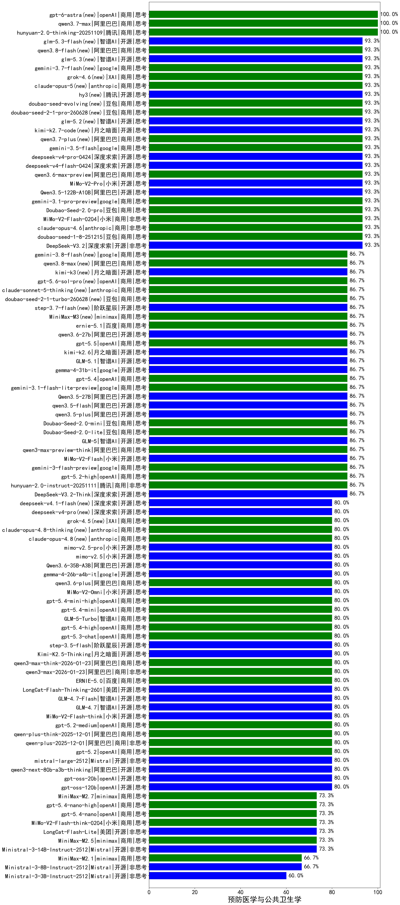

|类别|机构|大模型|【预防医学与公共卫生学】准确率|平均耗时|平均消耗token|花费/千次（元）|排名（准确率）|
|---|---|-----|-------------------|-------|-----------|-----------|-----------|
|商用|豆包|doubao-seed-1-6-lite-251015|100.0%|21s|674|1.4|1|
|商用|腾讯|hunyuan-2.0-thinking-20251109|100.0%|12s|753|2.8|2|
|商用|豆包|doubao-seed-1-8-251215|93.3%|30s|628|4.2|3|
|商用|豆包|Doubao-Seed-2.0-pro(new)|93.3%|208s|1003|14.5|4|
|开源|阿里巴巴|Qwen3-32B-nothink|93.3%|18s|449|1.5|5|
|开源|豆包|Seed-OSS-36B-Instruct|93.3%|129s|1565|6.1|6|
|商用|豆包|doubao-seed-1-6-251015|93.3%|11s|651|4.5|7|
|商用|anthropic|claude-opus-4.5|93.3%|11s|706|108.6|8|
|开源|深度求索|DeepSeek-V3.2|93.3%|93s|283|0.8|9|
|商用|anthropic|claude-opus-4.6|93.3%|12s|627|93.2|10|
|商用|小米|MiMo-V2-Flash-0204(new)|93.3%|230s|487|0.9|11|
|开源|阶跃星辰|step-3|93.3%|111s|1529|5.9|12|
|商用|google|gemini-3.1-pro-preview(new)|93.3%|63s|1619|132.4|13|
|商用|小米|MiMo-V2-Pro(new)|93.3%|291s|1020|16.9|14|
|开源|阿里巴巴|Qwen3.5-122B-A10B(new)|93.3%|204s|2607|16.3|15|
|商用|百度|ERNIE-4.5-Turbo-32K|90.0%|25s|549|1.6|16|
|商用|豆包|Doubao-Seed-2.0-lite(new)|86.7%|184s|835|2.6|17|
|商用|百度|ERNIE-5.0-Thinking-Preview|86.7%|180s|1477|34.3|18|
|商用|阿里巴巴|qwen-flash-2025-07-28|86.7%|6s|444|0.6|19|
|商用|阿里巴巴|qwen-flash-think-2025-07-28|86.7%|17s|1692|2.4|20|
|开源|google|gemma-4-31b-it(new)|86.7%|85s|499|1.2|21|
|商用|腾讯|hunyuan-turbos-20250926|86.7%|10s|489|0.8|22|
|商用|openAI|gpt-5.4(new)|86.7%|8s|254|18.7|23|
|商用|google|gemini-3.1-flash-lite-preview(new)|86.7%|15s|392|3.4|24|
|开源|月之暗面|Kimi-K2-Thinking|86.7%|83s|1231|18.8|25|
|商用|anthropic|claude-haiku-4.5-thinking|86.7%|24s|1904|64.3|26|
|商用|openAI|gpt-5.1-high|86.7%|21s|704|44.2|27|
|商用|百度|ERNIE-X1.1-Preview|86.7%|147s|997|3.8|28|
|开源|阿里巴巴|Qwen3.5-27B(new)|86.7%|314s|2469|11.5|29|
|商用|豆包|Doubao-Seed-2.0-mini(new)|86.7%|471s|2029|3.8|30|
|开源|深度求索|DeepSeek-V3.2-Think|86.7%|74s|1054|3.1|31|
|商用|腾讯|hunyuan-2.0-instruct-20251111|86.7%|7s|370|0.6|32|
|开源|阿里巴巴|qwen3.5-flash(new)|86.7%|138s|2594|5.0|33|
|商用|openAI|gpt-5.2-high|86.7%|10s|407|32.4|34|
|商用|google|gemini-3-flash-preview|86.7%|53s|1082|21.7|35|
|开源|阿里巴巴|Qwen3-30B-A3B-Thinking-2507|86.7%|56s|2198|6.0|36|
|开源|小米|MiMo-V2-Flash|86.7%|15s|491|0.0|37|
|商用|阿里巴巴|qwen3-max-preview-think|86.7%|190s|1811|42.0|38|
|开源|智谱AI|GLM-5(new)|86.7%|201s|1937|33.8|39|
|开源|阿里巴巴|qwen3.5-plus(new)|86.7%|35s|2705|12.7|40|
|商用|XAI|grok-4-1-fast-reasoning|86.7%|35s|954|2.9|41|
|开源|智谱AI|GLM-5.1(new)|86.7%|71s|1329|30.6|42|
|商用|智谱AI|GLM-4.5-Flash|86.7%|28s|1368|0.0|43|
|开源|阿里巴巴|qwen3-235b-a22b-thinking-2507|86.7%|102s|1809|34.7|44|
|商用|anthropic|claude-4-sonnet|86.7%|44s|553|49.1|45|
|开源|智谱AI|GLM-4.5-Air|86.7%|33s|1505|8.7|46|
|商用|anthropic|claude-4-sonnet-thinking|83.3%|51s|1238|123.6|47|
|开源|阿里巴巴|Qwen3-32B|81.7%|29s|1074|4.0|48|
|开源|智谱AI|GLM-4.7|80.0%|37s|1567|21.1|49|
|开源|小米|MiMo-V2-Flash-think|80.0%|108s|1605|0.0|50|
|商用|openAI|gpt-5.2-medium|80.0%|6s|302|21.8|51|
|开源|阿里巴巴|Qwen3-30B-A3B-Instruct-2507|80.0%|3s|440|1.1|52|
|开源|美团|LongCat-Flash-Thinking-2601|80.0%|172s|2101|0.0|53|
|商用|阿里巴巴|qwen-plus-think-2025-12-01|80.0%|41s|1867|14.3|54|
|商用|阿里巴巴|qwen-plus-2025-12-01|80.0%|18s|663|1.2|55|
|开源|Mistral|mistral-large-2512|80.0%|11s|466|4.2|56|
|开源|阿里巴巴|qwen3-next-80b-a3b-thinking|80.0%|91s|2351|9.2|57|
|商用|google|gemini-2.5-pro|80.0%|31s|2273|158.9|58|
|商用|openAI|gpt-5-nano-high|80.0%|501s|3024|8.5|59|
|开源|智谱AI|GLM-4.7-Flash|80.0%|1354s|2426|0.0|60|
|商用|阿里巴巴|qwen3-max-2026-01-23|80.0%|65s|368|3.1|61|
|商用|百度|ERNIE-5.0|80.0%|137s|1454|33.7|62|
|商用|腾讯|hunyuan-t1-20250711|80.0%|15s|953|3.5|63|
|商用|阿里巴巴|qwen3-max-think-2026-01-23|80.0%|146s|2185|21.2|64|
|开源|月之暗面|Kimi-K2.5-Thinking|80.0%|330s|1805|36.7|65|
|开源|阶跃星辰|step-3.5-flash|80.0%|19s|1169|2.3|66|
|商用|百度|ERNIE-X1-Turbo-32K|80.0%|135s|2508|9.8|67|
|商用|openAI|gpt-5.3-chat(new)|80.0%|22s|349|26.2|68|
|商用|openAI|gpt-5.4-high(new)|80.0%|18s|600|55.4|69|
|商用|智谱AI|GLM-5-Turbo(new)|80.0%|33s|1161|24.3|70|
|商用|openAI|gpt-5.4-mini(new)|80.0%|7s|243|5.2|71|
|商用|openAI|gpt-5.4-mini-high(new)|80.0%|113s|694|19.4|72|
|商用|小米|MiMo-V2-Omni(new)|80.0%|315s|1077|11.5|73|
|商用|阿里巴巴|qwen3.6-plus(new)|80.0%|39s|1407|16.1|74|
|开源|google|gemma-4-26b-a4b-it(new)|80.0%|70s|572|1.4|75|
|商用|阿里巴巴|qwen3-max-2025-09-23|80.0%|88s|381|7.7|76|
|商用|openAI|gpt-5.2|80.0%|4s|218|13.6|77|
|商用|阿里巴巴|qwen-turbo-2025-07-15|80.0%|8s|336|0.2|78|
|商用|openAI|gpt-5.1-medium|80.0%|128s|368|20.3|79|
|开源|openAI|gpt-oss-120b|80.0%|23s|549|1.4|80|
|开源|openAI|gpt-oss-20b|80.0%|86s|687|0.7|81|
|商用|openAI|gpt-5-2025-08-07|80.0%|32s|400|23.4|82|
|开源|深度求索|DeepSeek-V3.1|80.0%|20s|387|4.1|83|
|开源|深度求索|DeepSeek-V3.1-Think|80.0%|39s|776|8.8|84|
|商用|阿里巴巴|qwen-turbo-think-2025-07-15|80.0%|/|1699|4.9|85|
|商用|阿里巴巴|qwen3-max-preview|80.0%|8s|414|8.5|86|
|开源|阿里巴巴|qwen3-next-80b-a3b-instruct|80.0%|8s|502|1.8|87|
|开源|阿里巴巴|Qwen3-8B-nothink|80.0%|21s|446|0.0|88|
|开源|Mistral|Mistral-Small-3.2-24B-Instruct-2506|80.0%|343s|569|1.1|89|
|开源|阿里巴巴|qwen3-235b-a22b-instruct-2507|80.0%|10s|419|2.9|90|
|开源|月之暗面|kimi-k2-0905|80.0%|57s|328|4.1|91|
|商用|anthropic|claude-sonnet-4.5-thinking|80.0%|24s|1680|169.8|92|
|开源|深度求索|DeepSeek-R1-0528|78.3%|247s|1917|29.7|93|
|开源|meta|Llama-4-Maverick-17B-128E-Instruct-FP8|76.7%|7s|492|1.9|94|
|开源|百度|ERNIE-4.5-300B-A47B|76.7%|25s|389|2.6|95|
|商用|openAI|gpt-5.4-nano(new)|73.3%|36s|250|1.5|96|
|商用|anthropic|claude-sonnet-4.5(new)|73.3%|13s|600|54.9|97|
|商用|openAI|gpt-5-mini-2025-08-07|73.3%|44s|630|7.9|98|
|商用|openAI|gpt-5-nano-2025-08-07|73.3%|54s|1359|3.7|99|
|商用|Mistral|mistral-medium-2508|73.3%|22s|461|5.4|100|
|商用|openAI|gpt-5.4-nano-high(new)|73.3%|12s|327|2.2|101|
|商用|minimax|MiniMax-M2.7(new)|73.3%|31s|1322|10.4|102|
|开源|阿里巴巴|Qwen3-14B|73.3%|28s|1509|2.9|103|
|开源|智谱AI|GLM-4.5-Air-nothink|73.3%|13s|887|4.9|104|
|商用|openAI|o4-mini|73.3%|27s|747|21.7|105|
|开源|美团|LongCat-Flash-Lite(new)|73.3%|169s|400|0.0|106|
|商用|minimax|MiniMax-M2.5(new)|73.3%|23s|1110|8.7|107|
|商用|智谱AI|GLM-4.5-Flash-nothink|73.3%|18s|943|0.0|108|
|商用|google|gemini-2.5-flash|73.3%|10s|1783|30.9|109|
|商用|小米|MiMo-V2-Flash-think-0204(new)|73.3%|416s|1512|3.0|110|
|开源|Mistral|Ministral-3-14B-Instruct-2512|73.3%|9s|585|0.8|111|
|开源|阿里巴巴|Qwen3-14B-nothink|73.3%|11s|477|0.8|112|
|商用|XAI|grok-4-1-fast-non-reasoning|73.3%|56s|606|1.6|113|
|商用|anthropic|claude-haiku-4.5|73.3%|7s|617|18.5|114|
|商用|openAI|gpt-5.1|73.3%|70s|245|11.5|115|
|开源|深度求索|DeepSeek-R1-0528-Qwen3-8B|73.3%|278s|1825|0.0|116|
|开源|阿里巴巴|Qwen3-4B|71.7%|23s|1418|4.0|117|
|开源|阿里巴巴|Qwen3-8B|71.7%|232s|6349|0.0|118|
|开源|腾讯|Hunyuan-A13B-Instruct|71.7%|46s|940|3.5|119|
|开源|腾讯|Hunyuan-A13B-Instruct-nothink|66.7%|64s|386|1.3|120|
|商用|openAI|gpt-5-mini-high|66.7%|379s|1495|20.5|121|
|商用|百川智能|Baichuan4-Turbo|66.7%|/|/|/|122|
|开源|百度|ERNIE-4.5-21B-A3B|66.7%|37s|366|0.0|123|
|商用|minimax|MiniMax-M2.1|66.7%|98s|1248|9.8|124|
|开源|meta|Llama-4-Scout-17B-16E-Instruct|66.7%|8s|488|0.9|125|
|商用|google|gemini-2.5-flash-lite|66.7%|6s|1106|3.0|126|
|开源|阿里巴巴|Qwen3-4B-nothink|66.7%|11s|401|1.0|127|
|开源|Mistral|Ministral-3-8B-Instruct-2512|66.7%|10s|643|0.7|128|
|开源|Mistral|Ministral-3-3B-Instruct-2512|60.0%|9s|574|0.4|129|
|开源|google|gemma-3-27b-it|55.0%|/|/|/|130|
|开源|阿里巴巴|Qwen3-0.6B-nothink|53.3%|12s|247|0.5|131|
|开源|阿里巴巴|Qwen3-1.7B|48.3%|/|/|/|132|
|商用|百川智能|Baichuan4-Air|48.3%|/|/|/|133|
|开源|google|gemma-3-12b-it|43.3%|/|/|/|134|
|开源|智谱AI|GLM-4-9B-0414|43.3%|10s|422|0|135|
|开源|阿里巴巴|Qwen3-1.7B-nothink|40.0%|8s|443|1.1|136|
|开源|阿里巴巴|Qwen3-0.6B|38.3%|/|/|/|137|
|开源|google|gemma-3-4b-it|35.0%|/|/|/|138|
|开源|百度|ERNIE-4.5-0.3B|26.7%|40s|416|0.0|139|

