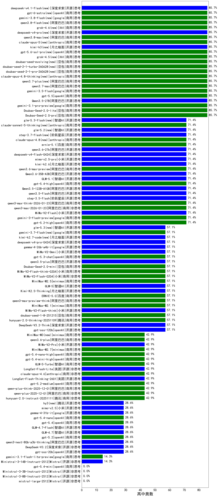

|类别|机构|大模型|【高中奥数】准确率|平均耗时|平均消耗token|花费/千次（元）|排名（准确率）|
|---|---|-----|-------------------|-------|-----------|-----------|-----------|
|商用|openAI|gpt-5.6-sol-pro(new)|85.7%|87s|16571|1904.1|1|
|商用|阿里巴巴|qwen3.7-plus(new)|85.7%|656s|36319|289.9|2|
|商用|XAI|grok-4-1-fast-reasoning|85.7%|197s|18943|66.7|3|
|开源|阿里巴巴|Qwen3.5-27B|85.7%|537s|35306|169.0|4|
|商用|openAI|gpt-5.5(new)|85.7%|106s|4921|1015.2|5|
|商用|google|gemini-3.5-flash(new)|85.7%|66s|15746|987.2|6|
|商用|阿里巴巴|qwen3.7-max(new)|85.7%|501s|28988|1041.0|7|
|商用|豆包|Doubao-Seed-2.0-lite|85.7%|944s|7064|25.0|8|
|商用|豆包|Doubao-Seed-2.0-pro|85.7%|829s|4446|69.3|9|
|商用|google|gemini-3.1-pro-preview|85.7%|270s|20303|1723.3|10|
|商用|豆包|doubao-seed-2-1-pro-260628(new)|85.7%|1100s|51333|1536.6|11|
|商用|豆包|doubao-seed-2-1-turbo-260628(new)|85.7%|815s|47747|714.5|12|
|商用|XAI|grok-4.5(new)|85.7%|441s|25952|1081.6|13|
|商用|anthropic|claude-opus-4.8-thinking(new)|85.7%|143s|11597|2009.7|14|
|商用|豆包|doubao-seed-evolving(new)|85.7%|938s|49001|1466.6|15|
|开源|阶跃星辰|step-3.5-flash|71.4%|194s|40384|84.7|16|
|开源|阿里巴巴|Qwen3.5-122B-A10B|71.4%|391s|39152|250.0|17|
|开源|豆包|Seed-OSS-36B-Instruct|71.4%|789s|14567|58.0|18|
|商用|豆包|doubao-seed-1-6-lite-251015|71.4%|369s|9073|21.5|19|
|商用|openAI|gpt-5.1-medium|71.4%|456s|11506|810.4|20|
|商用|openAI|gpt-5.4-high|71.4%|185s|9723|1011.8|21|
|商用|anthropic|claude-haiku-4.5-thinking|71.4%|200s|31881|1150.7|22|
|开源|阿里巴巴|qwen3.5-flash|71.4%|525s|33211|66.2|23|
|商用|阿里巴巴|qwen3-max-think-2026-01-23|71.4%|564s|21000|209.2|24|
|商用|百度|ERNIE-5.0-Thinking-Preview|71.4%|1655s|24520|586.9|25|
|商用|阿里巴巴|qwen3-max-2025-09-23|71.4%|301s|6344|150.3|26|
|商用|openAI|gpt-5-2025-08-07|71.4%|276s|1360|88.5|27|
|开源|小米|MiMo-V2-Flash|71.4%|243s|7500|0.0|28|
|商用|google|gemini-3-flash-preview|71.4%|177s|21100|447.8|29|
|商用|openAI|gpt-5.2-high|71.4%|742s|12182|833.7|30|
|商用|openAI|gpt-5-mini-2025-08-07|71.4%|61s|4542|64.6|31|
|商用|阿里巴巴|qwen3-max-2026-01-23|71.4%|142s|5854|57.7|32|
|开源|智谱AI|GLM-5.1|71.4%|468s|23948|573.0|33|
|开源|智谱AI|glm-5.2(new)|71.4%|524s|24578|686.1|34|
|开源|小米|mimo-v2.5-pro(new)|71.4%|525s|29350|611.4|35|
|开源|深度求索|deepseek-v4-flash(new)|71.4%|379s|28227|56.4|36|
|开源|阿里巴巴|Qwen3.6-35B-A3B|71.4%|222s|38856|418.7|37|
|开源|阶跃星辰|step-3.7-flash(new)|71.4%|432s|59289|479.5|38|
|开源|月之暗面|kimi-k2.6(new)|71.4%|1326s|38493|1037.2|39|
|商用|anthropic|claude-opus-4.8(new)|71.4%|34s|2753|462.1|40|
|开源|阿里巴巴|qwen3.6-27b(new)|71.4%|644s|44284|795.5|41|
|商用|百度|ernie-5.1(new)|71.4%|304s|12189|218.1|42|
|商用|anthropic|claude-sonnet-5-thinking(new)|71.4%|44s|4228|288.1|43|
|商用|阿里巴巴|qwen3.6-max-preview|71.4%|448s|16711|897.6|44|
|商用|openAI|gpt-5.1-high|66.7%|375s|20922|1479.2|45|
|商用|豆包|Doubao-Seed-2.0-mini|57.1%|291s|21224|42.2|46|
|商用|google|gemini-2.5-flash|57.1%|49s|11648|209.7|47|
|商用|小米|MiMo-V2-Flash-think-0204|57.1%|305s|22007|46.0|48|
|开源|深度求索|DeepSeek-V3.2-Think|57.1%|638s|18239|54.6|49|
|商用|腾讯|hunyuan-2.0-thinking-20251109|57.1%|167s|17677|70.4|50|
|商用|小米|MiMo-V2-Flash-0204|57.1%|598s|4585|9.5|51|
|商用|腾讯|hunyuan-t1-20250711|57.1%|226s|14980|59.5|52|
|商用|minimax|MiniMax-M2.5|57.1%|404s|27241|228.0|53|
|开源|智谱AI|GLM-5|57.1%|486s|18601|333.5|54|
|开源|月之暗面|kimi-k2.7-code(new)|57.1%|381s|8533|228.1|55|
|商用|豆包|doubao-seed-1-8-251215|57.1%|91s|3480|26.8|56|
|开源|小米|MiMo-V2-Flash-think|57.1%|235s|20183|0.0|57|
|开源|月之暗面|Kimi-K2.5-Thinking|57.1%|868s|36747|770.0|58|
|商用|minimax|MiniMax-M2.1|57.1%|332s|26599|222.6|59|
|商用|阿里巴巴|qwen3-max-preview-think|57.1%|408s|18694|446.7|60|
|开源|阿里巴巴|qwen3.5-plus|57.1%|372s|33639|161.0|61|
|商用|anthropic|claude-opus-4.5|57.1%|77s|7148|1253.9|62|
|商用|openAI|gpt-5-mini-high|57.1%|857s|21839|315.3|63|
|商用|百度|ERNIE-5.0|57.1%|1112s|29806|713.8|64|
|商用|阿里巴巴|qwen-flash-think-2025-07-28|57.1%|103s|11261|16.8|65|
|开源|小米|MiMo-V2-Omni|57.1%|241s|21657|299.3|66|
|开源|深度求索|DeepSeek-V3.1-Think|57.1%|640s|12558|150.0|67|
|商用|阿里巴巴|qwen3-max-preview|57.1%|73s|3363|78.9|68|
|开源|openAI|gpt-oss-120b|57.1%|19s|3994|12.6|69|
|开源|阿里巴巴|qwen3-next-80b-a3b-instruct|57.1%|61s|3924|15.4|70|
|开源|阿里巴巴|qwen3-235b-a22b-thinking-2507|57.1%|308s|11240|223.0|71|
|商用|腾讯|hunyuan-turbos-20250926|57.1%|138s|4956|9.8|72|
|商用|openAI|gpt-5.3-chat|57.1%|31s|2511|237.1|73|
|商用|智谱AI|GLM-4.5-Flash|57.1%|216s|14584|0.0|74|
|开源|深度求索|deepseek-v4-pro(new)|57.1%|478s|22774|545.3|75|
|商用|anthropic|claude-sonnet-4.5-thinking|57.1%|260s|19634|2121.4|76|
|开源|google|gemma-4-26b-a4b-it|57.1%|66s|1751|4.7|77|
|商用|openAI|gpt-5.4-nano-high|42.9%|933s|24456|177.9|78|
|商用|openAI|gpt-5.4-mini-high|42.9%|515s|26925|845.2|79|
|开源|美团|LongCat-Flash-Lite|42.9%|147s|5901|0.0|80|
|商用|minimax|MiniMax-M3(new)|42.9%|1117s|9044|148.5|81|
|商用|智谱AI|GLM-5-Turbo|42.9%|242s|26830|588.6|82|
|商用|minimax|MiniMax-M2.7|42.9%|622s|27524|230.4|83|
|开源|小米|MiMo-V2-Pro|42.9%|504s|31480|656.2|84|
|商用|阿里巴巴|qwen3.6-plus|42.9%|401s|25555|305.8|85|
|商用|anthropic|claude-opus-4.6|42.9%|23s|1406|227.9|86|
|商用|阿里巴巴|qwen-plus-2025-12-01|42.9%|135s|6051|12.0|87|
|开源|美团|LongCat-Flash-Thinking-2601|42.9%|250s|27942|0.0|88|
|商用|openAI|gpt-5-nano-high|42.9%|1925s|40061|115.9|89|
|开源|阿里巴巴|Qwen3-8B|42.9%|33s|2301|0.0|90|
|开源|深度求索|DeepSeek-R1-0528|42.9%|643s|14141|251.6|91|
|商用|google|gemini-2.5-pro|42.9%|104s|10792|777.0|92|
|开源|阿里巴巴|qwen3-235b-a22b-instruct-2507|42.9%|117s|4802|37.8|93|
|开源|智谱AI|GLM-4.5-Air|42.9%|293s|17030|101.7|94|
|开源|阿里巴巴|Qwen3-30B-A3B-Instruct-2507|42.9%|54s|5135|15.2|95|
|开源|阿里巴巴|Qwen3-30B-A3B-Thinking-2507|42.9%|242s|11500|32.0|96|
|开源|深度求索|DeepSeek-V3.1|42.9%|122s|2501|29.3|97|
|商用|阿里巴巴|qwen-turbo-think-2025-07-15|42.9%|/|13239|39.4|98|
|商用|豆包|doubao-seed-1-6-251015|42.9%|166s|5299|41.5|99|
|开源|月之暗面|Kimi-K2-Thinking|42.9%|2388s|42757|682.9|100|
|商用|阿里巴巴|qwen-flash-2025-07-28|42.9%|49s|4876|7.2|101|
|商用|openAI|gpt-5.2-medium|42.9%|619s|6650|651.9|102|
|商用|阿里巴巴|qwen-plus-think-2025-12-01|42.9%|505s|13321|105.8|103|
|商用|腾讯|hunyuan-2.0-instruct-20251111|42.9%|34s|3502|6.8|104|
|商用|openAI|o4-mini|40.0%|71s|4149|130.1|105|
|开源|深度求索|DeepSeek-V3.2|28.6%|140s|4419|13.2|106|
|开源|google|gemma-4-31b-it|28.6%|334s|1442|3.9|107|
|开源|腾讯|hy3(new)|28.6%|91s|3604|14.1|108|
|开源|阿里巴巴|Qwen3-32B|28.6%|51s|1793|6.9|109|
|开源|阿里巴巴|Qwen3-14B|28.6%|104s|5205|10.3|110|
|开源|智谱AI|GLM-4.7|28.6%|694s|24960|348.3|111|
|开源|阿里巴巴|Qwen3-4B|28.6%|31s|1937|5.5|112|
|商用|百度|ERNIE-X1-Turbo-32K|28.6%|893s|10614|42.5|113|
|商用|openAI|gpt-5.2|28.6%|19s|1270|117.1|114|
|商用|百度|ERNIE-X1.1-Preview|28.6%|659s|13616|54.2|115|
|开源|openAI|gpt-oss-20b|28.6%|639s|8931|10.2|116|
|商用|openAI|gpt-5-nano-2025-08-07|28.6%|100s|11117|32.0|117|
|开源|小米|mimo-v2.5(new)|28.6%|273s|24665|341.4|118|
|开源|智谱AI|GLM-4.7-Flash|28.6%|2261s|32877|0.0|119|
|开源|阿里巴巴|qwen3-next-80b-a3b-thinking|28.6%|277s|14199|56.5|120|
|商用|google|gemini-2.5-flash-lite|28.6%|35s|11763|33.9|121|
|商用|anthropic|claude-sonnet-4.5|28.6%|18s|1267|126.5|122|
|商用|XAI|grok-4-1-fast-non-reasoning|28.6%|72s|889|2.6|123|
|商用|openAI|gpt-5.4|28.6%|23s|1492|147.4|124|
|商用|openAI|gpt-5.4-nano|28.6%|233s|868|6.8|125|
|商用|anthropic|claude-4-sonnet-thinking|20.0%|17s|1335|133.9|126|
|开源|月之暗面|kimi-k2-0905|14.3%|85s|2306|35.4|127|
|商用|google|gemini-3.1-flash-lite-preview|14.3%|8s|1111|10.9|128|
|商用|anthropic|claude-haiku-4.5|14.3%|36s|1377|45.8|129|
|商用|百川智能|Baichuan4-Turbo|14.3%|/|/|/|130|
|开源|阿里巴巴|Qwen3-8B-nothink|14.3%|115s|2673|0.0|131|
|开源|阿里巴巴|Qwen3-14B-nothink|14.3%|65s|3526|6.9|132|
|开源|智谱AI|GLM-4.5-Air-nothink|14.3%|163s|10716|63.8|133|
|开源|Mistral|Ministral-3-14B-Instruct-2512|14.3%|111s|12317|17.5|134|
|开源|阿里巴巴|Qwen3-32B-nothink|14.3%|151s|2801|10.9|135|
|开源|阿里巴巴|Qwen3-4B-nothink|0.0%|77s|2432|7.0|136|
|开源|Mistral|mistral-large-2512|0.0%|58s|3044|31.8|137|
|开源|智谱AI|GLM-4-9B-0414|0.0%|25s|963|0.0|138|
|商用|智谱AI|GLM-4.5-Flash-nothink|0.0%|145s|6605|0.0|139|
|开源|Mistral|Ministral-3-3B-Instruct-2512|0.0%|126s|22906|16.3|140|
|商用|openAI|gpt-5.1|0.0%|114s|1043|67.5|141|
|开源|meta|Llama-4-Scout-17B-16E-Instruct|0.0%|29s|1501|3.1|142|
|商用|百度|ERNIE-4.5-Turbo-32K|0.0%|150s|4149|13.1|143|
|商用|openAI|gpt-5.4-mini|0.0%|128s|787|22.0|144|
|商用|anthropic|claude-4-sonnet|0.0%|93s|1162|117.3|145|
|开源|Mistral|Ministral-3-8B-Instruct-2512|0.0%|95s|15009|16.0|146|
|商用|阿里巴巴|qwen-turbo-2025-07-15|0.0%|42s|2795|1.6|147|

