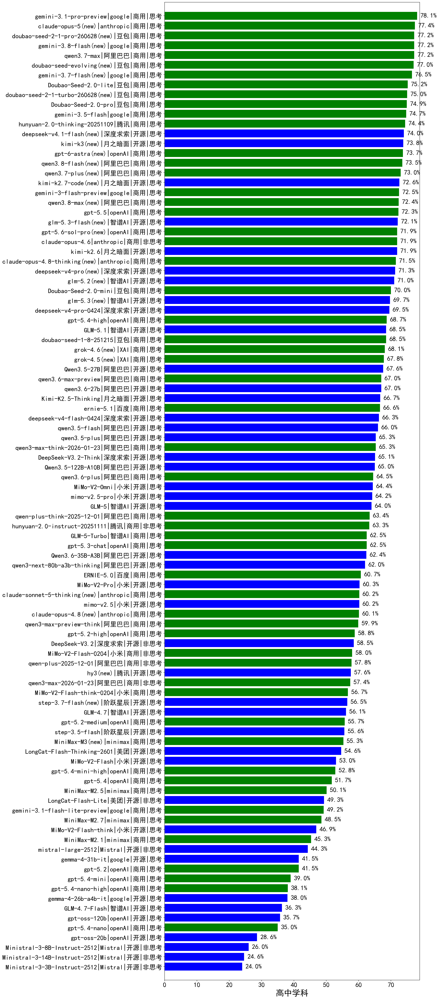

|类别|机构|大模型|【高中学科】准确率|平均耗时|平均消耗token|花费/千次（元）|排名（准确率）|
|---|---|-----|-------------------|-------|-----------|-----------|-----------|
|商用|google|gemini-3.1-pro-preview(new)|78.1%|56s|3357|273.2|1|
|商用|google|gemini-3-flash-preview|72.5%|88s|3558|72.6|2|
|商用|anthropic|claude-opus-4.6|71.9%|24s|961|131.4|3|
|商用|google|gemini-3-pro-preview|71.0%|78s|4316|354.9|4|
|开源|豆包|Seed-OSS-36B-Instruct|69.3%|196s|2656|10.1|5|
|商用|豆包|doubao-seed-1-6-251015|69.1%|103s|1490|10.5|6|
|商用|openAI|gpt-5.4-high(new)|68.7%|24s|1491|139.2|7|
|商用|豆包|doubao-seed-1-8-251215|68.5%|39s|1233|8.4|8|
|开源|月之暗面|Kimi-K2.5-Thinking|66.7%|473s|6177|127.0|9|
|商用|豆包|doubao-seed-1-6-lite-251015|66.4%|98s|1447|3.1|10|
|商用|腾讯|hunyuan-t1-20250711|65.5%|150s|2653|10.0|11|
|开源|阿里巴巴|qwen3-235b-a22b-thinking-2507|65.3%|197s|3736|67.7|12|
|开源|阿里巴巴|qwen3.5-plus(new)|65.3%|69s|5864|27.5|13|
|商用|阿里巴巴|qwen3-max-think-2026-01-23|65.3%|345s|6234|61.0|14|
|商用|anthropic|claude-opus-4.5|64.8%|23s|1109|160.1|15|
|商用|阿里巴巴|qwen3.6-plus(new)|64.5%|73s|3386|39.0|16|
|开源|智谱AI|GLM-5(new)|64.0%|166s|4655|81.5|17|
|商用|阿里巴巴|qwen-plus-think-2025-12-01|63.4%|104s|4931|38.2|18|
|商用|腾讯|hunyuan-2.0-instruct-20251111|63.3%|26s|920|1.6|19|
|商用|智谱AI|GLM-5-Turbo(new)|62.5%|66s|3657|77.7|20|
|商用|openAI|gpt-5.3-chat(new)|62.5%|24s|794|60.8|21|
|商用|豆包|doubao-seed-1-6-250615|62.5%|110s|540|3.1|22|
|商用|anthropic|claude-sonnet-4.5-thinking|62.0%|63s|4603|475.2|23|
|商用|豆包|doubao-seed-1-6-flash-thinking-250615|61.9%|21s|1519|2.0|24|
|商用|阿里巴巴|qwen-plus-think-2025-07-28|61.8%|/|3623|27.6|25|
|商用|科大讯飞|xunfei-spark-x1-0725|61.8%|/|2446|28.4|26|
|开源|百度|ERNIE-4.5-300B-A47B|61.2%|291s|775|5.3|27|
|商用|腾讯|hunyuan-turbos-20250926|61.1%|22s|1016|1.8|28|
|商用|小米|MiMo-V2-Pro(new)|60.3%|296s|2522|47.1|29|
|开源|阿里巴巴|Qwen3-32B|59.8%|86s|3308|12.8|30|
|商用|百度|ERNIE-X1-Turbo-32K|59.7%|269s|2785|10.8|31|
|商用|openAI|gpt-5.1-high|59.7%|106s|4101|278.8|32|
|商用|openAI|gpt-5-2025-08-07|59.4%|94s|715|41.0|33|
|商用|百度|ERNIE-X1.1-Preview|59.0%|237s|3834|14.9|34|
|开源|深度求索|DeepSeek-V3.2|58.5%|70s|902|2.6|35|
|开源|深度求索|DeepSeek-V3.2-Exp-Think|58.2%|165s|1993|5.8|36|
|开源|深度求索|DeepSeek-V3.2-Exp|58.1%|66s|716|2.0|37|
|商用|小米|MiMo-V2-Flash-0204(new)|58.0%|408s|1438|2.7|38|
|商用|阿里巴巴|qwen-plus-2025-12-01|57.8%|47s|1970|3.7|39|
|商用|阿里巴巴|qwen3-max-2026-01-23|57.4%|72s|1542|14.1|40|
|商用|豆包|doubao-seed-1-6-flash-250615|56.9%|7s|597|0.7|41|
|商用|小米|MiMo-V2-Flash-think-0204(new)|56.7%|543s|4601|9.4|42|
|商用|百度|ERNIE-5.0-Thinking-Preview|56.6%|549s|4226|98.7|43|
|开源|智谱AI|GLM-4.7|56.1%|129s|4256|57.8|44|
|商用|百度|ERNIE-4.5-Turbo-32K|55.9%|29s|860|2.5|45|
|开源|深度求索|DeepSeek-V3.1|55.9%|31s|741|7.5|46|
|开源|深度求索|DeepSeek-V3.1-Think|55.7%|94s|1974|22.3|47|
|开源|阿里巴巴|qwen3-235b-a22b-instruct-2507|55.7%|113s|1308|9.5|48|
|商用|阿里巴巴|qwen3-max-preview|54.8%|48s|986|20.1|49|
|商用|google|gemini-2.5-pro|54.2%|61s|3708|258.6|50|
|商用|阿里巴巴|qwen-flash-think-2025-07-28|54.2%|136s|3575|5.1|51|
|开源|阿里巴巴|qwen3-next-80b-a3b-instruct|54.1%|43s|1305|4.6|52|
|商用|openAI|gpt-5.1-medium|53.8%|150s|1926|124.4|53|
|开源|阿里巴巴|Qwen3-30B-A3B-Thinking-2507|52.9%|178s|3517|9.5|54|
|商用|阿里巴巴|qwen-plus-2025-07-28|52.6%|58s|1263|2.3|55|
|开源|美团|LongCat-Flash-Thinking-2601|52.1%|410s|6512|0.0|56|
|开源|月之暗面|Kimi-K2-Thinking|51.9%|542s|8940|141.2|57|
|商用|openAI|gpt-5.4(new)|51.7%|20s|591|44.6|58|
|开源|腾讯|Hunyuan-A13B-Instruct|50.6%|241s|1891|7.1|59|
|开源|智谱AI|GLM-4.6|50.2%|77s|3788|50.6|60|
|商用|minimax|MiniMax-M2.5(new)|50.1%|66s|3724|30.1|61|
|商用|阿里巴巴|qwen-turbo-think-2025-07-15|50.1%|/|3961|11.3|62|
|商用|anthropic|claude-sonnet-4.5(new)|49.9%|13s|897|74.8|63|
|开源|美团|LongCat-Flash-Lite(new)|49.3%|275s|1437|0.0|64|
|商用|google|gemini-3.1-flash-lite-preview(new)|49.2%|26s|668|5.4|65|
|开源|阿里巴巴|Qwen3-30B-A3B-Instruct-2507|47.9%|109s|1276|3.4|66|
|商用|XAI|grok-4-0709|47.5%|362s|5157|548.6|67|
|开源|深度求索|DeepSeek-R1-0528|46.9%|242s|3775|58.9|68|
|商用|阿里巴巴|qwen-flash-2025-07-28|46.0%|109s|1309|1.7|69|
|商用|openAI|gpt-5-mini-2025-08-07|45.9%|72s|1518|19.8|70|
|开源|月之暗面|kimi-k2-0905|45.5%|118s|1097|15.4|71|
|开源|百度|ERNIE-4.5-21B-A3B|45.4%|137s|808|0.1|72|
|商用|anthropic|claude-4-sonnet-thinking|44.8%|59s|1404|137.1|73|
|开源|智谱AI|GLM-4.5-Air|44.5%|116s|3873|22.4|74|
|开源|阿里巴巴|Qwen3-14B|44.5%|232s|8291|16.4|75|
|开源|腾讯|Hunyuan-A13B-Instruct-nothink|44.4%|429s|647|2.1|76|
|开源|智谱AI|GLM-4.5-nothink|44.3%|134s|1815|23.7|77|
|商用|阿里巴巴|qwen-turbo-2025-07-15|43.4%|83s|830|0.5|78|
|开源|智谱AI|GLM-4.5-Air-nothink|42.9%|79s|2297|13.0|79|
|开源|智谱AI|GLM-4.5|42.6%|123s|3829|51.7|80|
|商用|百川智能|Baichuan4-Air|42.4%|/|/|/|81|
|开源|阶跃星辰|step-3|42.3%|255s|3987|15.6|82|
|商用|google|gemini-2.5-flash|42.0%|81s|3142|54.4|83|
|商用|anthropic|claude-haiku-4.5-thinking|41.6%|74s|7287|255.3|84|
|开源|google|gemma-4-31b-it(new)|41.5%|115s|817|1.9|85|
|商用|openAI|gpt-5.2|41.5%|8s|485|30.9|86|
|商用|openAI|o4-mini|40.5%|26s|1386|40.5|87|
|开源|meta|Llama-4-Scout-17B-16E-Instruct|40.2%|12s|643|1.2|88|
|商用|Mistral|mistral-medium-2508|39.8%|95s|913|10.3|89|
|商用|智谱AI|GLM-4.5-Flash|39.4%|69s|3724|0.0|90|
|商用|openAI|gpt-5.1|39.0%|119s|602|30.3|91|
|商用|anthropic|claude-4-sonnet|38.5%|44s|693|59.8|92|
|商用|智谱AI|GLM-4.5-Flash-nothink|38.5%|45s|2090|0.0|93|
|开源|minimax|MiniMax-M2|38.2%|67s|4195|34.1|94|
|开源|google|gemma-4-26b-a4b-it(new)|38.0%|78s|1008|2.5|95|
|商用|XAI|grok-4-1-fast-reasoning|37.9%|98s|3543|11.9|96|
|开源|阿里巴巴|Qwen3-8B|37.2%|487s|10131|0.0|97|
|商用|百川智能|Baichuan4-Turbo|36.9%|/|/|/|98|
|开源|阿里巴巴|Qwen3-32B-nothink|36.5%|135s|888|3.1|99|
|商用|anthropic|claude-haiku-4.5|36.3%|17s|918|25.2|100|
|开源|智谱AI|GLM-4.7-Flash|36.3%|1678s|9722|0.0|101|
|开源|openAI|gpt-oss-120b|35.7%|132s|1269|3.5|102|
|商用|openAI|gpt-5-nano-2025-08-07|35.5%|144s|3335|9.2|103|
|开源|阿里巴巴|Qwen3-1.7B|35.4%|72s|4551|13.3|104|
|商用|XAI|grok-3-mini|33.9%|231s|1719|6.0|105|
|开源|阿里巴巴|Qwen3-8B-nothink|33.1%|37s|893|0.0|106|
|开源|meta|Llama-4-Maverick-17B-128E-Instruct-FP8|32.8%|10s|683|2.6|107|
|开源|智谱AI|GLM-4-9B-0414|32.2%|16s|590|0.0|108|
|开源|阿里巴巴|Qwen3-14B-nothink|32.1%|48s|955|1.7|109|
|开源|google|gemma-3-27b-it|31.5%|/|/|/|110|
|开源|阿里巴巴|Qwen3-4B-nothink|29.2%|97s|783|1.9|111|
|开源|openAI|gpt-oss-20b|28.6%|148s|2408|2.6|112|
|商用|XAI|grok-4-1-fast-non-reasoning|28.4%|65s|715|1.8|113|
|开源|阿里巴巴|Qwen3-4B|28.1%|127s|3941|11.5|114|
|开源|深度求索|DeepSeek-R1-0528-Qwen3-8B|27.6%|402s|3912|0.0|115|
|开源|google|gemma-3-4b-it|25.9%|/|/|/|116|
|商用|google|gemini-2.5-flash-lite|25.7%|30s|2887|7.9|117|
|开源|Mistral|Mistral-Small-3.2-24B-Instruct-2506|25.6%|134s|1206|2.3|118|
|开源|阿里巴巴|Qwen3-0.6B|25.6%|47s|3150|9.1|119|
|开源|阿里巴巴|Qwen3-0.6B-nothink|22.0%|73s|480|1.0|120|
|开源|google|gemma-3-12b-it|22.0%|/|/|/|121|
|开源|阿里巴巴|Qwen3-1.7B-nothink|21.5%|97s|814|2.0|122|
|开源|百度|ERNIE-4.5-0.3B|19.3%|114s|599|0.0|123|
|开源|阿里巴巴|Qwen3.5-122B-A10B(new)|/%|513s|6553|41.0|124|
|商用|腾讯|hunyuan-2.0-thinking-20251109|/%|38s|2427|9.3|125|
|开源|Mistral|mistral-large-2512|/%|19s|992|9.0|126|
|开源|小米|MiMo-V2-Flash|/%|55s|2059|0.0|127|
|商用|openAI|gpt-5.4-mini(new)|/%|/|488|10.1|128|
|开源|阿里巴巴|Qwen3.5-27B(new)|/%|436s|7624|35.9|129|
|商用|openAI|gpt-5.4-nano(new)|/%|/|558|3.4|130|
|商用|openAI|gpt-5.4-nano-high(new)|/%|/|2388|19.4|131|
|商用|minimax|MiniMax-M2.7(new)|/%|/|/|40.2|132|
|商用|小米|MiMo-V2-Omni(new)|/%|358s|3660|46.5|133|
|开源|Mistral|Ministral-3-3B-Instruct-2512|/%|12s|1861|1.3|134|
|商用|openAI|gpt-5.4-mini-high(new)|/%|/|2490|73.2|135|
|商用|豆包|Doubao-Seed-2.0-mini(new)|/%|500s|4055|7.7|136|
|开源|阿里巴巴|qwen3.5-flash(new)|/%|520s|7157|14.0|137|
|商用|openAI|gpt-5.2-high|/%|37s|1562|137.9|138|
|商用|openAI|gpt-5-nano-high|/%|584s|8446|24.0|139|
|商用|minimax|MiniMax-M2.1|/%|145s|4838|39.4|140|
|商用|阿里巴巴|qwen3-max-preview-think|/%|261s|4686|109.3|141|
|商用|openAI|gpt-5-mini-high|/%|232s|4010|55.6|142|
|商用|openAI|gpt-5.2-medium|/%|28s|1184|100.3|143|
|商用|百度|ERNIE-5.0|/%|278s|5007|117.5|144|
|开源|阶跃星辰|step-3.5-flash|/%|42s|6809|14.1|145|
|开源|阿里巴巴|qwen3-next-80b-a3b-thinking|/%|194s|5557|21.7|146|
|商用|阿里巴巴|qwen3-max-2025-09-23|/%|128s|1528|33.5|147|
|开源|Mistral|Ministral-3-8B-Instruct-2512|/%|10s|1309|1.4|148|
|开源|深度求索|DeepSeek-V3.2-Think|/%|196s|3307|9.8|149|
|商用|豆包|Doubao-Seed-2.0-pro(new)|/%|291s|1493|21.2|150|
|商用|豆包|Doubao-Seed-2.0-lite(new)|/%|286s|1586|5.1|151|
|开源|小米|MiMo-V2-Flash-think|/%|119s|5028|0.0|152|
|开源|Mistral|Ministral-3-14B-Instruct-2512|/%|17s|1648|2.3|153|

