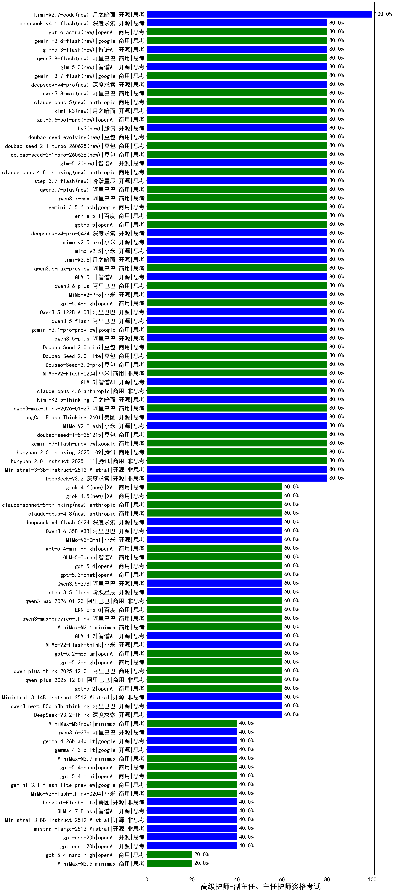

|类别|机构|大模型|【高级护师-副主任、主任护师资格考试】准确率|平均耗时|平均消耗token|花费/千次（元）|排名（准确率）|
|---|---|-----|-------------------|-------|-----------|-----------|-----------|
|商用|豆包|doubao-seed-1-6-lite-251015|80.0%|24s|797|1.7|1|
|商用|阿里巴巴|qwen3-max-preview|80.0%|11s|381|7.9|2|
|开源|阿里巴巴|qwen3-235b-a22b-instruct-2507|80.0%|9s|390|2.7|3|
|商用|小米|MiMo-V2-Flash-0204(new)|80.0%|181s|356|0.6|4|
|开源|智谱AI|GLM-5(new)|80.0%|88s|1613|28.2|5|
|开源|阿里巴巴|Qwen3-8B-nothink|80.0%|20s|372|0.0|6|
|商用|anthropic|claude-opus-4.6|80.0%|11s|542|82.1|7|
|开源|月之暗面|Kimi-K2.5-Thinking|80.0%|461s|2245|46.1|8|
|商用|阿里巴巴|qwen3-max-think-2026-01-23|80.0%|101s|2696|26.4|9|
|商用|openAI|gpt-5-2025-08-07|80.0%|64s|153|7.1|10|
|开源|深度求索|DeepSeek-V3.1|80.0%|18s|336|3.6|11|
|开源|深度求索|DeepSeek-V3.1-Think|80.0%|41s|740|8.4|12|
|开源|小米|MiMo-V2-Flash|80.0%|15s|372|0.0|13|
|开源|Mistral|Mistral-Small-3.2-24B-Instruct-2506|80.0%|20s|470|0.9|14|
|商用|阿里巴巴|qwen-plus-2025-07-28|80.0%|8s|363|0.6|15|
|开源|豆包|Seed-OSS-36B-Instruct|80.0%|89s|1603|6.3|16|
|商用|豆包|Doubao-Seed-2.0-pro(new)|80.0%|269s|1153|17.1|17|
|开源|深度求索|DeepSeek-V3.2-Exp|80.0%|482s|253|0.7|18|
|商用|腾讯|hunyuan-turbos-20250926|80.0%|11s|453|0.8|19|
|商用|豆包|doubao-seed-1-8-251215|80.0%|26s|640|4.4|20|
|商用|豆包|doubao-seed-1-6-251015|80.0%|9s|622|4.3|21|
|商用|google|gemini-3-flash-preview|80.0%|102s|939|18.9|22|
|商用|openAI|gpt-5.1|80.0%|108s|188|9.0|23|
|商用|google|gemini-3-pro-preview|80.0%|70s|1339|109.7|24|
|商用|openAI|gpt-5.1-high|80.0%|46s|1093|73.3|25|
|商用|anthropic|claude-opus-4.5|80.0%|10s|582|90.8|26|
|商用|阿里巴巴|qwen3-max-2025-09-23|80.0%|18s|360|7.5|27|
|商用|腾讯|hunyuan-2.0-thinking-20251109|80.0%|13s|742|2.8|28|
|商用|腾讯|hunyuan-2.0-instruct-20251111|80.0%|8s|301|0.5|29|
|开源|深度求索|DeepSeek-V3.2|80.0%|9s|273|0.8|30|
|商用|腾讯|hunyuan-t1-20250711|80.0%|19s|1234|4.6|31|
|开源|Mistral|Ministral-3-3B-Instruct-2512|80.0%|82s|13501|9.6|32|
|商用|豆包|Doubao-Seed-2.0-lite(new)|80.0%|255s|951|3.1|33|
|商用|小米|MiMo-V2-Pro(new)|80.0%|510s|1029|17.3|34|
|商用|百度|ERNIE-4.5-Turbo-32K|80.0%|22s|522|1.6|35|
|开源|阿里巴巴|Qwen3.5-122B-A10B(new)|80.0%|130s|2953|18.5|36|
|开源|阿里巴巴|qwen3.5-flash(new)|80.0%|253s|3504|6.9|37|
|商用|google|gemini-3.1-pro-preview(new)|80.0%|27s|1094|88.9|38|
|开源|阿里巴巴|qwen3.5-plus(new)|80.0%|28s|2190|10.3|39|
|商用|openAI|gpt-5.4-high(new)|80.0%|12s|698|67.2|40|
|商用|XAI|grok-4-0709|80.0%|177s|1687|177.4|41|
|商用|豆包|Doubao-Seed-2.0-mini(new)|80.0%|160s|2539|4.9|42|
|商用|阿里巴巴|qwen3.6-plus(new)|80.0%|30s|1488|17.3|43|
|商用|百度|ERNIE-X1-Turbo-32K|75.0%|65s|1557|6.1|44|
|开源|百度|ERNIE-4.5-300B-A47B|75.0%|23s|345|2.4|45|
|商用|豆包|doubao-seed-1-6-flash-thinking-250615|70.0%|6s|520|0.6|46|
|商用|豆包|doubao-seed-1-6-flash-250615|70.0%|4s|310|0.4|47|
|开源|阿里巴巴|Qwen3-30B-A3B-Thinking-2507|70.0%|66s|2307|6.3|48|
|商用|豆包|doubao-seed-1-6-250615|70.0%|126s|394|2.5|49|
|商用|openAI|gpt-5.2-medium|60.0%|8s|346|28.4|50|
|商用|百川智能|Baichuan4-Turbo|60.0%|/|/|/|51|
|商用|openAI|gpt-5.3-chat(new)|60.0%|5s|347|28.0|52|
|开源|月之暗面|Kimi-K2-Thinking|60.0%|162s|2100|32.9|53|
|开源|深度求索|DeepSeek-V3.2-Think|60.0%|171s|1323|3.9|54|
|开源|阿里巴巴|qwen3-next-80b-a3b-thinking|60.0%|103s|3876|15.3|55|
|开源|阿里巴巴|Qwen3.5-27B(new)|60.0%|331s|2778|13.1|56|
|商用|openAI|gpt-5.1-medium|60.0%|187s|632|40.6|57|
|商用|小米|MiMo-V2-Omni(new)|60.0%|403s|1295|14.7|58|
|商用|openAI|gpt-5.2-high|60.0%|12s|428|36.5|59|
|商用|阿里巴巴|qwen-plus-think-2025-12-01|60.0%|81s|3197|25.1|60|
|商用|阿里巴巴|qwen-plus-2025-12-01|60.0%|17s|697|1.3|61|
|商用|openAI|gpt-5.4(new)|60.0%|3s|195|14.3|62|
|开源|月之暗面|kimi-k2-0905|60.0%|89s|277|3.5|63|
|商用|openAI|o4-mini|60.0%|26s|665|19.4|64|
|商用|anthropic|claude-sonnet-4.5(new)|60.0%|9s|555|52.5|65|
|商用|anthropic|claude-sonnet-4.5-thinking|60.0%|23s|1390|140.8|66|
|商用|百度|ERNIE-X1.1-Preview|60.0%|121s|487|1.8|67|
|商用|openAI|gpt-5.2|60.0%|6s|141|8.0|68|
|商用|智谱AI|GLM-5-Turbo(new)|60.0%|26s|1424|30.3|69|
|商用|openAI|gpt-5.4-mini-high(new)|60.0%|16s|827|24.2|70|
|开源|深度求索|DeepSeek-V3.2-Exp-Think|60.0%|484s|933|2.7|71|
|商用|阿里巴巴|qwen-plus-think-2025-07-28|60.0%|/|3488|27.4|72|
|开源|阿里巴巴|qwen3-next-80b-a3b-instruct|60.0%|7s|476|1.7|73|
|开源|深度求索|DeepSeek-R1-0528|60.0%|220s|1607|25.0|74|
|开源|腾讯|Hunyuan-A13B-Instruct-nothink|60.0%|10s|369|1.3|75|
|开源|阿里巴巴|qwen3-235b-a22b-thinking-2507|60.0%|58s|3516|69.1|76|
|商用|科大讯飞|xunfei-spark-x1-0725|60.0%|/|883|10.6|77|
|开源|阿里巴巴|Qwen3-1.7B-nothink|60.0%|9s|398|1.0|78|
|开源|腾讯|Hunyuan-A13B-Instruct|60.0%|89s|809|3.1|79|
|开源|百度|ERNIE-4.5-21B-A3B|60.0%|60s|313|0.0|80|
|开源|阿里巴巴|Qwen3-32B-nothink|60.0%|257s|429|1.5|81|
|开源|阶跃星辰|step-3.5-flash|60.0%|23s|3367|7.0|82|
|开源|阿里巴巴|Qwen3-30B-A3B-Instruct-2507|60.0%|4s|462|1.2|83|
|商用|阿里巴巴|qwen3-max-2026-01-23|60.0%|77s|458|4.1|84|
|开源|Mistral|Ministral-3-14B-Instruct-2512|60.0%|6s|731|1.0|85|
|开源|智谱AI|GLM-4.5-Air-nothink|60.0%|10s|777|4.3|86|
|商用|智谱AI|GLM-4.5-Flash-nothink|60.0%|21s|815|0.0|87|
|开源|美团|LongCat-Flash-Thinking-2601|60.0%|527s|2790|0.0|88|
|商用|阿里巴巴|qwen3-max-preview-think|60.0%|89s|2199|51.6|89|
|商用|minimax|MiniMax-M2.1|60.0%|169s|1532|12.3|90|
|开源|智谱AI|GLM-4.7|60.0%|70s|2176|29.8|91|
|开源|小米|MiMo-V2-Flash-think|60.0%|20s|2052|0.0|92|
|商用|阿里巴巴|qwen-flash-think-2025-07-28|60.0%|24s|2557|3.7|93|
|商用|Mistral|mistral-medium-2508|60.0%|21s|486|6.1|94|
|开源|深度求索|DeepSeek-R1-0528-Qwen3-8B|60.0%|125s|1528|0.0|95|
|商用|阿里巴巴|qwen-turbo-2025-07-15|60.0%|7s|319|0.2|96|
|商用|阿里巴巴|qwen-turbo-think-2025-07-15|60.0%|/|2067|6.0|97|
|商用|百度|ERNIE-5.0|60.0%|129s|2559|60.5|98|
|开源|阿里巴巴|Qwen3-14B|55.0%|33s|1698|3.3|99|
|开源|阿里巴巴|Qwen3-4B|55.0%|26s|1914|5.6|100|
|商用|百川智能|Baichuan4-Air|50.0%|/|/|/|101|
|开源|阿里巴巴|Qwen3-32B|50.0%|38s|1494|5.8|102|
|开源|阿里巴巴|Qwen3-8B|50.0%|114s|3450|0.0|103|
|商用|XAI|grok-3-mini|50.0%|103s|956|3.4|104|
|开源|阿里巴巴|Qwen3-1.7B|50.0%|22s|2267|6.6|105|
|开源|智谱AI|GLM-4-9B-0414|50.0%|12s|404|0.0|106|
|开源|阿里巴巴|Qwen3-4B-nothink|40.0%|13s|341|0.8|107|
|开源|Mistral|mistral-large-2512|40.0%|15s|520|5.0|108|
|商用|小米|MiMo-V2-Flash-think-0204(new)|40.0%|135s|1797|3.7|109|
|商用|anthropic|claude-4-sonnet-thinking|40.0%|8s|550|51.9|110|
|商用|anthropic|claude-4-sonnet|40.0%|46s|529|48.2|111|
|商用|google|gemini-3.1-flash-lite-preview(new)|40.0%|37s|388|3.5|112|
|开源|Mistral|Ministral-3-8B-Instruct-2512|40.0%|4s|502|0.5|113|
|开源|智谱AI|GLM-4.5-Air|40.0%|48s|2241|13.1|114|
|开源|meta|Llama-4-Maverick-17B-128E-Instruct-FP8|40.0%|9s|466|1.8|115|
|商用|openAI|gpt-5.4-mini(new)|40.0%|7s|179|3.8|116|
|开源|meta|Llama-4-Scout-17B-16E-Instruct|40.0%|9s|489|1.0|117|
|商用|openAI|gpt-5.4-nano(new)|40.0%|49s|182|1.1|118|
|商用|minimax|MiniMax-M2.7(new)|40.0%|50s|1984|16.1|119|
|开源|google|gemma-3-27b-it|40.0%|/|/|/|120|
|开源|google|gemma-4-31b-it(new)|40.0%|46s|521|1.3|121|
|商用|智谱AI|GLM-4.5-Flash|40.0%|23s|1292|0.0|122|
|开源|美团|LongCat-Flash-Lite(new)|40.0%|41s|329|0.0|123|
|开源|智谱AI|GLM-4.5|40.0%|73s|1430|19.4|124|
|开源|openAI|gpt-oss-20b|40.0%|12s|1695|1.9|125|
|商用|百度|ERNIE-5.0-Thinking-Preview|40.0%|218s|1532|35.8|126|
|商用|XAI|grok-4-1-fast-reasoning|40.0%|84s|1021|3.2|127|
|商用|anthropic|claude-haiku-4.5-thinking|40.0%|40s|2269|78.3|128|
|开源|minimax|MiniMax-M2|40.0%|16s|1055|8.3|129|
|开源|智谱AI|GLM-4.6|40.0%|44s|1890|25.8|130|
|商用|google|gemini-2.5-flash-lite|40.0%|2s|402|1.0|131|
|开源|google|gemma-4-26b-a4b-it(new)|40.0%|63s|554|1.4|132|
|开源|智谱AI|GLM-4.7-Flash|40.0%|1957s|1358|0.0|133|
|开源|openAI|gpt-oss-120b|40.0%|10s|580|1.6|134|
|开源|智谱AI|GLM-4.5-nothink|40.0%|18s|674|8.7|135|
|商用|google|gemini-2.5-flash|35.0%|11s|1577|27.6|136|
|商用|google|gemini-2.5-pro|35.0%|40s|2395|169.6|137|
|开源|阿里巴巴|Qwen3-0.6B|30.0%|16s|1106|3.1|138|
|开源|google|gemma-3-12b-it|30.0%|/|/|/|139|
|商用|XAI|grok-4-1-fast-non-reasoning|20.0%|5s|577|1.6|140|
|商用|openAI|gpt-5-nano-high|20.0%|968s|3088|8.8|141|
|商用|openAI|gpt-5-mini-high|20.0%|1001s|2468|34.9|142|
|开源|阶跃星辰|step-3|20.0%|113s|2238|8.8|143|
|商用|openAI|gpt-5.4-nano-high(new)|20.0%|83s|502|3.9|144|
|商用|anthropic|claude-haiku-4.5|20.0%|10s|555|17.1|145|
|商用|minimax|MiniMax-M2.5(new)|20.0%|31s|1642|13.2|146|
|开源|阿里巴巴|Qwen3-0.6B-nothink|20.0%|3s|199|0.4|147|
|开源|阿里巴巴|Qwen3-14B-nothink|20.0%|8s|433|0.8|148|
|商用|openAI|gpt-5-nano-2025-08-07|20.0%|110s|1178|3.2|149|
|商用|openAI|gpt-5-mini-2025-08-07|20.0%|41s|919|12.4|150|
|商用|阿里巴巴|qwen-flash-2025-07-28|20.0%|9s|447|0.6|151|
|开源|百度|ERNIE-4.5-0.3B|15.0%|58s|378|0.0|152|
|开源|google|gemma-3-4b-it|15.0%|/|/|/|153|

