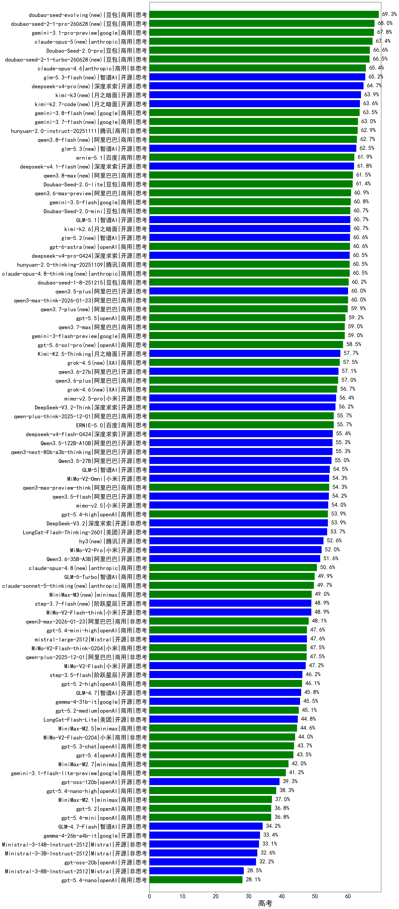

|类别|机构|大模型|【高考】准确率|平均耗时|平均消耗token|花费/千次（元）|排名（准确率）|
|---|---|-----|-------------------|-------|-----------|-----------|-----------|
|商用|google|gemini-3.1-pro-preview(new)|67.8%|66s|3731|302.3|1|
|商用|豆包|Doubao-Seed-2.0-pro(new)|66.6%|322s|1617|22.7|2|
|商用|豆包|doubao-seed-1-6-thinking-250715|66.3%|33s|1873|13.5|3|
|商用|anthropic|claude-opus-4.6(new)|65.4%|19s|1044|140.4|4|
|商用|百度|ERNIE-X1.1-Preview|64.0%|180s|2668|10.1|5|
|商用|腾讯|hunyuan-2.0-instruct-20251111|62.9%|27s|1108|1.9|6|
|商用|google|gemini-3-pro-preview(new)|62.6%|73s|4921|404.2|7|
|商用|豆包|doubao-seed-1-6-251015|62.0%|33s|1523|10.5|8|
|商用|豆包|Doubao-Seed-2.0-lite(new)|61.4%|328s|1744|5.5|9|
|商用|豆包|Doubao-Seed-2.0-mini(new)|60.7%|411s|4035|7.6|10|
|商用|腾讯|hunyuan-2.0-thinking-20251109|60.5%|47s|2993|11.3|11|
|商用|豆包|doubao-seed-1-8-251215(new)|60.2%|41s|1330|8.9|12|
|商用|豆包|doubao-seed-1-6-lite-251015|60.1%|161s|1535|3.2|13|
|开源|阿里巴巴|qwen3.5-plus(new)|60.0%|69s|5904|27.5|14|
|商用|阿里巴巴|qwen3-max-think-2026-01-23(new)|60.0%|271s|5988|58.2|15|
|开源|豆包|Seed-OSS-36B-Instruct|59.8%|208s|2515|9.6|16|
|商用|google|gemini-3-flash-preview(new)|59.0%|107s|3773|76.6|17|
|开源|深度求索|DeepSeek-V3.2-Exp|57.7%|128s|674|1.8|18|
|开源|月之暗面|Kimi-K2.5-Thinking(new)|57.7%|464s|5708|116.6|19|
|商用|阿里巴巴|qwen-plus-think-2025-07-28|57.6%|/|3128|23.3|20|
|开源|深度求索|DeepSeek-V3.2-Think(new)|56.2%|190s|3256|9.6|21|
|商用|anthropic|claude-opus-4.5(new)|56.1%|22s|1301|188.5|22|
|开源|阿里巴巴|qwen3-235b-a22b-thinking-2507|55.8%|142s|3147|54.9|23|
|商用|阿里巴巴|qwen-plus-think-2025-12-01(new)|55.7%|122s|4709|36.1|24|
|商用|百度|ERNIE-5.0(new)|55.7%|289s|4821|112.3|25|
|商用|阿里巴巴|qwen-plus-2025-07-28|55.5%|89s|1194|2.1|26|
|开源|阿里巴巴|Qwen3.5-122B-A10B(new)|55.3%|442s|6735|42.0|27|
|开源|阿里巴巴|qwen3-next-80b-a3b-thinking|55.3%|176s|5303|20.6|28|
|开源|阿里巴巴|Qwen3.5-27B(new)|55.0%|457s|6685|31.2|29|
|开源|智谱AI|GLM-5(new)|54.5%|203s|5257|91.8|30|
|商用|阿里巴巴|qwen3-max-preview-think(new)|54.3%|218s|4644|107.6|31|
|开源|阿里巴巴|qwen3.5-flash(new)|54.2%|451s|6836|13.3|32|
|开源|深度求索|DeepSeek-V3.2(new)|53.9%|88s|960|2.7|33|
|商用|腾讯|hunyuan-turbos-20250926|53.5%|21s|1089|1.8|34|
|商用|阿里巴巴|qwen3-max-preview|53.0%|80s|956|19.1|35|
|开源|腾讯|Hunyuan-A13B-Instruct|52.2%|237s|1718|6.3|36|
|商用|豆包|doubao-seed-1-6-250615|52.1%|121s|568|2.9|37|
|开源|百度|ERNIE-4.5-300B-A47B|52.1%|260s|841|5.5|38|
|商用|腾讯|hunyuan-t1-20250711|52.0%|100s|2638|9.3|39|
|开源|深度求索|DeepSeek-V3.1|51.8%|27s|681|6.7|40|
|商用|anthropic|claude-sonnet-4.5-thinking|51.8%|63s|4609|472.5|41|
|商用|百度|ERNIE-4.5-Turbo-32K|51.4%|179s|734|1.9|42|
|开源|阿里巴巴|qwen3-235b-a22b-instruct-2507|50.6%|77s|1243|8.6|43|
|开源|深度求索|DeepSeek-V3.1-Think|50.3%|73s|1630|18.1|44|
|开源|深度求索|DeepSeek-V3.2-Exp-Think|50.1%|200s|1844|5.3|45|
|开源|月之暗面|kimi-k2-0711-preview|49.0%|79s|1041|14.3|46|
|开源|小米|MiMo-V2-Flash-think(new)|48.9%|101s|4861|0.0|47|
|开源|月之暗面|Kimi-K2-Thinking|48.8%|503s|8690|136.8|48|
|商用|豆包|doubao-seed-1-6-flash-250615|48.3%|10s|650|0.7|49|
|商用|anthropic|claude-sonnet-4.5(new)|48.3%|15s|954|77.4|50|
|开源|月之暗面|kimi-k2-0905|48.2%|112s|1306|18.4|51|
|商用|阿里巴巴|qwen3-max-2026-01-23(new)|48.1%|126s|1701|15.4|52|
|商用|百度|ERNIE-5.0-Thinking-Preview|48.0%|445s|4398|102.2|53|
|商用|openAI|gpt-5-2025-08-07|47.9%|74s|773|41.4|54|
|商用|openAI|gpt-5.1-high|47.8%|137s|3932|264.6|55|
|开源|Mistral|mistral-large-2512(new)|47.6%|19s|1032|9.2|56|
|商用|小米|MiMo-V2-Flash-think-0204(new)|47.5%|615s|4380|8.9|57|
|商用|阿里巴巴|qwen-plus-2025-12-01(new)|47.5%|48s|2099|3.9|58|
|商用|google|gemini-2.5-pro|47.4%|70s|3625|249.2|59|
|商用|百度|ERNIE-X1-Turbo-32K|47.4%|277s|2961|11.2|60|
|开源|小米|MiMo-V2-Flash(new)|47.2%|63s|1606|0.0|61|
|商用|豆包|doubao-seed-1-6-flash-thinking-250615|46.4%|23s|1344|1.7|62|
|开源|智谱AI|GLM-4.5-nothink|46.4%|100s|1686|21.3|63|
|开源|阶跃星辰|step-3.5-flash(new)|46.2%|54s|6821|14.0|64|
|商用|openAI|gpt-5.2-high(new)|46.1%|34s|1499|128.7|65|
|开源|百度|ERNIE-4.5-21B-A3B|46.0%|137s|910|0.2|66|
|开源|智谱AI|GLM-4.7(new)|45.8%|128s|4641|62.8|67|
|开源|阿里巴巴|qwen3-next-80b-a3b-instruct|45.8%|75s|1165|4.0|68|
|商用|阿里巴巴|qwen-turbo-think-2025-07-15|45.7%|/|3485|9.8|69|
|商用|阿里巴巴|qwen3-max-2025-09-23|45.7%|199s|1614|34.9|70|
|商用|anthropic|claude-haiku-4.5-thinking|45.3%|71s|7019|244.4|71|
|商用|openAI|gpt-5.2-medium(new)|45.1%|21s|1119|90.9|72|
|商用|openAI|gpt-5.1-medium|44.9%|143s|1771|111.2|73|
|开源|阿里巴巴|Qwen3-30B-A3B-Thinking-2507|44.9%|134s|3122|8.3|74|
|开源|美团|LongCat-Flash-Lite(new)|44.9%|314s|1701|0.0|75|
|商用|minimax|MiniMax-M2.5(new)|44.6%|70s|3851|31.0|76|
|开源|美团|LongCat-Flash-Thinking-2601(new)|44.5%|574s|6136|0.0|77|
|商用|小米|MiMo-V2-Flash-0204(new)|44.0%|377s|1510|2.8|78|
|商用|openAI|o4-mini|43.7%|57s|1255|34.5|79|
|开源|智谱AI|GLM-4.5|43.6%|102s|3398|45.2|80|
|开源|腾讯|Hunyuan-A13B-Instruct-nothink|43.4%|377s|714|2.2|81|
|商用|豆包|Doubao-1.5-lite-32k-250115|42.5%|58s|499|0.2|82|
|开源|智谱AI|GLM-4.6|42.4%|80s|3888|52.4|83|
|商用|阿里巴巴|qwen-flash-think-2025-07-28|42.4%|79s|3014|4.2|84|
|商用|google|gemini-2.5-flash|41.1%|52s|3083|52.5|85|
|商用|anthropic|claude-4-sonnet|40.9%|42s|849|65.6|86|
|开源|阿里巴巴|Qwen3-30B-A3B-Instruct-2507|40.5%|71s|1265|3.3|87|
|开源|minimax|MiniMax-M2|39.3%|79s|4186|33.8|88|
|开源|阿里巴巴|Qwen3-32B|39.3%|320s|5801|22.5|89|
|开源|openAI|gpt-oss-120b|39.3%|96s|1245|3.3|90|
|商用|anthropic|claude-4-sonnet-thinking|39.1%|63s|1536|140.3|91|
|开源|阿里巴巴|Qwen3-14B|38.9%|326s|8373|16.4|92|
|商用|openAI|gpt-5-mini-high|38.7%|399s|3909|53.7|93|
|开源|阶跃星辰|step-3|38.6%|214s|3568|13.8|94|
|商用|XAI|grok-3-mini|38.2%|182s|1562|5.4|95|
|商用|科大讯飞|xunfei-spark-x1-0725|38.0%|/|2272|26.9|96|
|开源|阿里巴巴|Qwen3-32B-nothink|37.7%|103s|932|3.1|97|
|商用|XAI|grok-4-1-fast-reasoning|37.5%|97s|2964|9.8|98|
|开源|智谱AI|GLM-4.5-Air-nothink|37.4%|80s|2401|13.3|99|
|开源|深度求索|DeepSeek-R1-0528|37.1%|294s|3249|49.7|100|
|商用|minimax|MiniMax-M2.1(new)|37.0%|156s|4504|36.4|101|
|商用|openAI|gpt-5.2(new)|36.8%|9s|524|31.8|102|
|商用|智谱AI|GLM-4.5-Flash-nothink|36.6%|51s|2150|0.0|103|
|商用|openAI|gpt-5.1|36.5%|113s|616|29.3|104|
|商用|openAI|gpt-5-mini-2025-08-07|36.5%|83s|1385|17.1|105|
|商用|阿里巴巴|qwen-turbo-2025-07-15|36.0%|57s|848|0.4|106|
|开源|阿里巴巴|Qwen3-14B-nothink|35.6%|57s|975|1.6|107|
|商用|阿里巴巴|qwen-flash-2025-07-28|35.1%|68s|1274|1.6|108|
|商用|anthropic|claude-haiku-4.5|34.8%|14s|982|26.4|109|
|商用|openAI|gpt-5-nano-high|34.5%|520s|8515|24.1|110|
|开源|minimax|MiniMax-Text-01|34.4%|111s|1074|5.6|111|
|开源|minimax|MiniMax-M1|34.3%|261s|4487|32.8|112|
|开源|智谱AI|GLM-4.7-Flash(new)|34.2%|1430s|10356|0.0|113|
|商用|百川智能|Baichuan4-Turbo|33.9%|/|/|/|114|
|开源|智谱AI|GLM-4.5-Air|33.3%|98s|3554|20.2|115|
|商用|360|360zhinao2-o1|33.2%|/|/|/|116|
|开源|Mistral|Ministral-3-14B-Instruct-2512(new)|33.1%|22s|2288|3.3|117|
|商用|openAI|gpt-5-nano-2025-08-07|33.1%|93s|3086|8.3|118|
|商用|智谱AI|GLM-4.5-Flash|33.0%|78s|3330|0.0|119|
|开源|Mistral|Ministral-3-3B-Instruct-2512(new)|32.6%|18s|2862|2.0|120|
|开源|openAI|gpt-oss-20b|32.2%|127s|2141|2.2|121|
|商用|Mistral|mistral-medium-2508|32.1%|141s|796|8.6|122|
|商用|阿里巴巴|qwen-long-2025-01-25|31.5%|36s|673|1.0|123|
|开源|Mistral|Magistral-Small-2507|30.2%|217s|7098|75.4|124|
|开源|Mistral|Mistral-Small-3.2-24B-Instruct-2506|30.1%|112s|1175|2.2|125|
|开源|meta|Llama-4-Maverick-17B-128E-Instruct-FP8|29.9%|121s|802|2.9|126|
|开源|深度求索|DeepSeek-R1-0528-Qwen3-8B|29.9%|307s|3172|0.0|127|
|商用|XAI|grok-4-0709|29.8%|254s|2174|218.6|128|
|开源|阿里巴巴|Qwen3-4B-nothink|29.3%|77s|836|1.9|129|
|开源|Mistral|Ministral-3-8B-Instruct-2512(new)|28.5%|19s|2343|2.5|130|
|开源|meta|Llama-4-Scout-17B-16E-Instruct|28.5%|144s|733|1.3|131|
|开源|智谱AI|GLM-4-9B-0414|28.4%|73s|779|0.0|132|
|开源|google|gemma-3-27b-it|27.3%|/|/|/|133|
|开源|阿里巴巴|Qwen3-8B|27.0%|506s|12247|0.0|134|
|商用|百川智能|Baichuan4-Air|26.4%|/|/|/|135|
|商用|google|gemini-2.5-flash-lite|26.3%|50s|3244|9.0|136|
|开源|阿里巴巴|Qwen3-1.7B-nothink|25.7%|77s|867|2.0|137|
|开源|阿里巴巴|Qwen3-4B|24.7%|209s|3768|10.7|138|
|商用|XAI|grok-4-1-fast-non-reasoning|23.6%|83s|739|1.8|139|
|商用|百度|ERNIE-Lite-8K|22.5%|/|/|/|140|
|开源|阿里巴巴|Qwen3-0.6B-nothink|21.6%|64s|529|1.0|141|
|开源|阿里巴巴|Qwen3-8B-nothink|21.4%|36s|931|0.0|142|
|开源|阿里巴巴|Qwen3-1.7B|20.5%|188s|4190|12.0|143|
|开源|阿里巴巴|Qwen3-0.6B|18.8%|146s|3191|9.0|144|
|开源|google|gemma-3-12b-it|18.6%|/|/|/|145|
|开源|google|gemma-3-4b-it|18.1%|/|/|/|146|
|开源|百度|ERNIE-4.5-0.3B|17.2%|137s|648|0.0|147|

