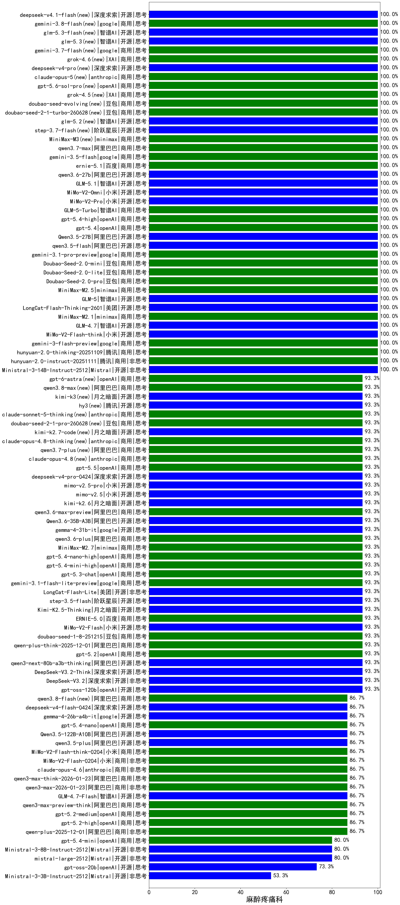

|类别|机构|大模型|【麻醉疼痛科】准确率|平均耗时|平均消耗token|花费/千次（元）|排名（准确率）|
|---|---|-----|-------------------|-------|-----------|-----------|-----------|
|开源|智谱AI|GLM-5|100.0%|63s|1854|32.2|1|
|商用|openAI|gpt-5.4-high|100.0%|10s|580|51.2|2|
|商用|百度|ernie-5.1|100.0%|33s|897|15.0|3|
|开源|阿里巴巴|qwen3.6-27b|100.0%|29s|1770|30.5|4|
|开源|智谱AI|GLM-5.1|100.0%|164s|1475|33.8|5|
|开源|Mistral|Ministral-3-14B-Instruct-2512|100.0%|7s|661|0.9|6|
|商用|腾讯|hunyuan-2.0-instruct-20251111|100.0%|11s|429|0.7|7|
|商用|腾讯|hunyuan-2.0-thinking-20251109|100.0%|14s|841|3.1|8|
|开源|小米|MiMo-V2-Omni|100.0%|72s|1347|15.1|9|
|开源|小米|MiMo-V2-Pro|100.0%|81s|1143|19.3|10|
|商用|google|gemini-3-flash-preview|100.0%|40s|1549|31.4|11|
|商用|智谱AI|GLM-5-Turbo|100.0%|35s|1519|32.0|12|
|开源|小米|MiMo-V2-Flash-think|100.0%|27s|1893|0.0|13|
|商用|google|gemini-3.5-flash|100.0%|8s|1417|84.5|14|
|开源|智谱AI|GLM-4.7|100.0%|49s|1831|24.7|15|
|商用|minimax|MiniMax-M2.1|100.0%|91s|1381|10.9|16|
|商用|openAI|gpt-5.4|100.0%|5s|343|26.4|17|
|开源|美团|LongCat-Flash-Thinking-2601|100.0%|215s|2372|0.0|18|
|开源|阿里巴巴|Qwen3.5-27B|100.0%|330s|2763|12.9|19|
|开源|阿里巴巴|qwen3.5-flash|100.0%|237s|3447|6.7|20|
|商用|google|gemini-3.1-pro-preview|100.0%|58s|1855|151.6|21|
|商用|豆包|Doubao-Seed-2.0-mini|100.0%|327s|1497|2.8|22|
|商用|豆包|Doubao-Seed-2.0-lite|100.0%|168s|855|2.7|23|
|商用|豆包|Doubao-Seed-2.0-pro|100.0%|184s|882|12.5|24|
|商用|anthropic|claude-sonnet-4.5-thinking|100.0%|30s|2050|208.4|25|
|商用|minimax|MiniMax-M2.5|100.0%|34s|1638|13.0|26|
|商用|openAI|gpt-5.1-high|100.0%|101s|1156|75.2|27|
|商用|豆包|doubao-seed-1-6-251015|100.0%|63s|649|4.4|28|
|商用|阿里巴巴|qwen3.7-max|100.0%|20s|1018|34.5|29|
|商用|豆包|doubao-seed-evolving(new)|100.0%|304s|7833|232.0|30|
|开源|智谱AI|glm-5.2(new)|100.0%|40s|1809|48.8|31|
|商用|XAI|grok-4.5(new)|100.0%|89s|1676|62.3|32|
|商用|openAI|gpt-5.6-sol-pro(new)|100.0%|30s|3354|254.6|33|
|开源|阶跃星辰|step-3.7-flash(new)|100.0%|30s|2566|20.2|34|
|商用|豆包|doubao-seed-2-1-turbo-260628(new)|100.0%|163s|5748|84.7|35|
|商用|anthropic|claude-opus-5(new)|100.0%|17s|721|106.9|36|
|开源|深度求索|deepseek-v4-pro(new)|100.0%|23s|743|17.2|37|
|商用|XAI|grok-4.6(new)|100.0%|434s|1718|64.1|38|
|商用|google|gemini-3.7-flash(new)|100.0%|10s|802|19.1|39|
|商用|minimax|MiniMax-M3(new)|100.0%|29s|785|10.0|40|
|开源|智谱AI|glm-5.3(new)|100.0%|63s|1720|46.3|41|
|商用|google|gemini-3.1-flash-lite-preview|93.3%|7s|431|3.7|42|
|商用|openAI|gpt-5.3-chat|93.3%|17s|427|32.4|43|
|商用|阿里巴巴|qwen3.8-max(new)|93.3%|32s|1493|50.7|44|
|开源|腾讯|hy3(new)|93.3%|55s|270|0.8|45|
|商用|anthropic|claude-sonnet-5-thinking(new)|93.3%|14s|829|50.4|46|
|开源|月之暗面|kimi-k3(new)|93.3%|36s|562|43.3|47|
|商用|minimax|MiniMax-M2.7|93.3%|60s|2440|19.8|48|
|商用|openAI|gpt-5.4-mini-high|93.3%|111s|680|18.5|49|
|商用|阿里巴巴|qwen3.6-max-preview|93.3%|58s|1799|93.2|50|
|商用|anthropic|claude-opus-4.8(new)|93.3%|11s|633|91.6|51|
|商用|openAI|gpt-5.5|93.3%|7s|452|75.6|52|
|开源|深度求索|deepseek-v4-pro-0424|93.3%|65s|2077|48.9|53|
|开源|美团|LongCat-Flash-Lite|93.3%|167s|587|0.0|54|
|开源|小米|mimo-v2.5|93.3%|27s|1469|16.8|55|
|开源|月之暗面|kimi-k2.6|93.3%|77s|1615|41.9|56|
|开源|阿里巴巴|Qwen3.6-35B-A3B|93.3%|77s|2082|21.7|57|
|商用|openAI|gpt-5.4-nano-high|93.3%|12s|641|4.8|58|
|商用|阿里巴巴|qwen3.7-plus(new)|93.3%|26s|1318|10.0|59|
|开源|google|gemma-4-31b-it|93.3%|62s|546|1.3|60|
|商用|阿里巴巴|qwen3.6-plus|93.3%|34s|1640|18.8|61|
|商用|anthropic|claude-opus-4.8-thinking(new)|93.3%|15s|890|136.5|62|
|开源|月之暗面|kimi-k2.7-code(new)|93.3%|20s|649|15.8|63|
|商用|豆包|doubao-seed-2-1-pro-260628(new)|93.3%|240s|7489|221.7|64|
|开源|小米|mimo-v2.5-pro|93.3%|22s|1329|23.2|65|
|开源|openAI|gpt-oss-120b|93.3%|81s|750|2.0|66|
|商用|anthropic|claude-opus-4.5|93.3%|15s|954|150.3|67|
|商用|openAI|gpt-5.2|93.3%|10s|273|17.6|68|
|商用|阿里巴巴|qwen-plus-think-2025-12-01|93.3%|54s|2065|15.8|69|
|商用|openAI|gpt-5.1-medium|93.3%|191s|657|39.8|70|
|商用|百度|ERNIE-X1.1-Preview|93.3%|125s|858|3.2|71|
|商用|豆包|doubao-seed-1-8-251215|93.3%|22s|658|4.4|72|
|开源|小米|MiMo-V2-Flash|93.3%|180s|534|0.0|73|
|商用|腾讯|hunyuan-turbos-20250926|93.3%|15s|653|1.2|74|
|开源|阿里巴巴|qwen3-next-80b-a3b-instruct|93.3%|9s|621|2.2|75|
|商用|百度|ERNIE-5.0|93.3%|235s|1952|45.5|76|
|开源|阿里巴巴|qwen3-next-80b-a3b-thinking|93.3%|161s|3006|11.7|77|
|开源|深度求索|DeepSeek-V3.2-Think|93.3%|168s|1274|3.7|78|
|开源|深度求索|DeepSeek-V3.1-Think|93.3%|54s|1008|11.4|79|
|开源|月之暗面|Kimi-K2.5-Thinking|93.3%|414s|1974|40.0|80|
|开源|深度求索|DeepSeek-V3.1|93.3%|17s|369|3.8|81|
|开源|阶跃星辰|step-3.5-flash|93.3%|19s|1473|3.0|82|
|开源|深度求索|DeepSeek-V3.2|93.3%|65s|377|1.1|83|
|商用|百度|ERNIE-5.0-Thinking-Preview|93.3%|167s|1603|37.1|84|
|商用|anthropic|claude-sonnet-4.5|86.7%|11s|679|61.8|85|
|开源|月之暗面|kimi-k2-0905|86.7%|96s|479|6.4|86|
|商用|XAI|grok-4-1-fast-reasoning|86.7%|93s|1896|6.2|87|
|商用|小米|MiMo-V2-Flash-0204|86.7%|314s|618|1.1|88|
|商用|anthropic|claude-haiku-4.5-thinking|86.7%|35s|2533|86.6|89|
|商用|openAI|gpt-5.1|86.7%|137s|298|14.3|90|
|开源|月之暗面|Kimi-K2-Thinking|86.7%|360s|6398|101.4|91|
|商用|阿里巴巴|qwen3-max-2025-09-23|86.7%|72s|566|11.9|92|
|商用|阿里巴巴|qwen3-max-preview|86.7%|14s|597|12.6|93|
|商用|阿里巴巴|qwen-turbo-think-2025-07-15|86.7%|/|2168|6.2|94|
|商用|阿里巴巴|qwen-flash-2025-07-28|86.7%|8s|712|0.9|95|
|商用|openAI|gpt-5-2025-08-07|86.7%|17s|352|18.9|96|
|商用|豆包|doubao-seed-1-6-lite-251015|86.7%|29s|849|1.8|97|
|商用|阿里巴巴|qwen3.8-flash(new)|86.7%|30s|1904|4.9|98|
|开源|深度求索|deepseek-v4-flash-0424|86.7%|33s|641|1.2|99|
|商用|openAI|gpt-5.4-nano|86.7%|88s|308|1.9|100|
|商用|anthropic|claude-opus-4.6|86.7%|15s|689|101.3|101|
|开源|阿里巴巴|qwen3.5-plus|86.7%|34s|2609|12.2|102|
|商用|阿里巴巴|qwen3-max-think-2026-01-23|86.7%|182s|2904|28.3|103|
|商用|阿里巴巴|qwen3-max-2026-01-23|86.7%|54s|618|5.5|104|
|开源|阿里巴巴|Qwen3.5-122B-A10B|86.7%|273s|3215|20.1|105|
|开源|智谱AI|GLM-4.7-Flash|86.7%|915s|2571|0.0|106|
|商用|小米|MiMo-V2-Flash-think-0204|86.7%|847s|2136|4.3|107|
|商用|openAI|gpt-5.2-medium|86.7%|8s|357|25.9|108|
|商用|阿里巴巴|qwen3-max-preview-think|86.7%|156s|2293|53.3|109|
|商用|openAI|gpt-5.2-high|86.7%|7s|438|34.0|110|
|开源|google|gemma-4-26b-a4b-it|86.7%|56s|621|1.5|111|
|商用|阿里巴巴|qwen-plus-2025-12-01|86.7%|21s|889|1.7|112|
|商用|openAI|gpt-5-nano-high|86.7%|409s|4083|11.6|113|
|商用|openAI|gpt-5-mini-2025-08-07|80.0%|67s|907|11.8|114|
|商用|openAI|gpt-5-nano-2025-08-07|80.0%|23s|2069|5.7|115|
|商用|阿里巴巴|qwen-flash-think-2025-07-28|80.0%|19s|1910|2.7|116|
|开源|Mistral|mistral-large-2512|80.0%|14s|577|5.2|117|
|商用|google|gemini-2.5-flash-lite|80.0%|2s|519|1.3|118|
|商用|anthropic|claude-haiku-4.5|80.0%|19s|669|19.8|119|
|开源|Mistral|Ministral-3-8B-Instruct-2512|80.0%|7s|666|0.7|120|
|商用|XAI|grok-4-1-fast-non-reasoning|80.0%|58s|725|2.0|121|
|开源|豆包|Seed-OSS-36B-Instruct|80.0%|140s|2222|8.7|122|
|商用|openAI|gpt-5.4-mini|80.0%|13s|300|6.6|123|
|商用|openAI|gpt-5-mini-high|80.0%|283s|1782|24.4|124|
|开源|openAI|gpt-oss-20b|73.3%|13s|1435|1.5|125|
|开源|Mistral|Ministral-3-3B-Instruct-2512|53.3%|13s|1152|0.8|126|

